# LAPORAN ANALISIS, PERANCANGAN, DAN HASIL
## BIDANG INFORMATIKA: SISTEM INFORMASI PRESENSI PERKULIAHAN
---

## BAB IV: ANALISIS DAN PERANCANGAN SISTEM

### 4.1 ANALISIS

#### 4.1.1 Analisis Masalah
Pencatatan kehadiran mahasiswa dalam kegiatan perkuliahan merupakan salah satu indikator penting dalam evaluasi akademis dan kelayakan mahasiswa untuk mengikuti Ujian Akhir Semester (UAS). Namun, sistem presensi konvensional (menggunakan tanda tangan kertas) memiliki berbagai celah masalah:

1. **Kecurangan Akademis (*Titip Absen*):** Mahasiswa dapat dengan mudah memalsukan tanda tangan rekannya yang tidak hadir, sehingga data kehadiran tidak merepresentasikan kondisi aktual di kelas.
2. **Kehilangan atau Kerusakan Data:** Lembaran kertas presensi rentan sobek, hilang, atau terkena tumpahan cairan, yang berakibat pada hilangnya bukti fisik kehadiran mahasiswa.
3. **Ketidakefisienan Rekapitulasi:** Di akhir semester, dosen atau staf administrasi akademik harus menghitung secara manual persentase kehadiran tiap mahasiswa dari lembaran kertas ke dalam spreadsheet. Proses ini membutuhkan waktu lama dan rawan kesalahan hitung (*human error*).
4. **Kurangnya Akurasi Waktu:** Tanda tangan manual tidak mencatat waktu kedatangan secara presisi. Mahasiswa yang terlambat 30 menit atau lebih tetap mendapat status kehadiran yang sama dengan yang datang tepat waktu, tanpa ada sanksi keterlambatan yang objektif.
5. **Kerentanan Manipulasi Database:** Pada sistem digital biasa, administrator atau pihak luar yang memiliki akses ke database dapat mengubah data kehadiran secara langsung tanpa terdeteksi oleh sistem.

**Sebab-sebab terjadi permasalahan:**
* Tidak adanya pencatatan waktu otomatis saat kehadiran dilakukan.
* Tidak adanya mekanisme validasi terpusat yang membatasi hak akses pengisian kehadiran secara tepat waktu.
* Kurangnya proteksi kriptografis pada setiap record kehadiran untuk menjamin integritas data (data integrity).

**Solusi yang Diterapkan:**
Untuk mengatasi masalah tersebut, dibangun **Sistem Informasi Presensi Perkuliahan** berbasis web yang mengintegrasikan:
* **Perhitungan Toleransi Keterlambatan Otomatis:** Sistem mencatat waktu presensi secara *real-time* dan membandingkannya dengan jam mulai kelas + toleransi keterlambatan (misal 15 menit). Status otomatis berubah menjadi `TERLAMBAT` atau `ALPHA` (jika melewati batas keterlambatan maksimal).
* **Fitur Auto-Alpha saat Sesi Ditutup:** Ketika dosen menutup sesi perkuliahan, mahasiswa anggota kelas yang belum melakukan absensi secara otomatis diubah statusnya menjadi `ALPHA` oleh sistem melalui transaksi database yang aman.
* **Validasi Integritas Kriptografi (SHA-256):** Setiap record kehadiran dikunci menggunakan hash integrity `SHA-256` dengan format string `nim|kode_mk|tanggal|status`. Jika ada perubahan langsung di database secara ilegal, sistem dapat mendeteksi ketidakcocokan hash tersebut.

---

#### 4.1.2 Analisis Software (Kebutuhan Perangkat Lunak)
Berikut adalah kebutuhan perangkat lunak minimum yang digunakan untuk membangun dan menjalankan aplikasi Sistem Informasi Presensi Perkuliahan:

| No | Perangkat Lunak | Kebutuhan Minimum | Fungsi / Keterangan |
|----|-----------------|-------------------|---------------------|
| 1  | Sistem Operasi  | Windows 10 / Linux Ubuntu 20.04 LTS | Platform dasar pengembangan dan deployment. |
| 2  | Web Server      | Apache 2.4.x / Nginx 1.18.x | Menangani permintaan HTTP dari klien. |
| 3  | Database Engine | MySQL 8.x / MariaDB 10.4.x | Menyimpan data terelasi, view, dan relasi integritas. |
| 4  | Interpreter     | PHP 8.1.x atau lebih tinggi | Bahasa backend utama (mendukung fitur `match` expression). |
| 5  | Web Browser     | Chrome 100+, Firefox 98+, Safari 15+ | Antarmuka pengguna untuk berinteraksi dengan aplikasi. |
| 6  | Text Editor/IDE | VS Code / PHPStorm | Lingkungan pengembangan penulisan kode program. |
| 7  | DBMS Client     | phpMyAdmin / DBeaver | Manajemen dan administrasi database secara visual. |

---

#### 4.1.3 Analisis Pengguna (User Analysis)
Sistem ini dirancang untuk melayani 3 aktor utama dengan karakteristik dan fungsi akses yang berbeda:

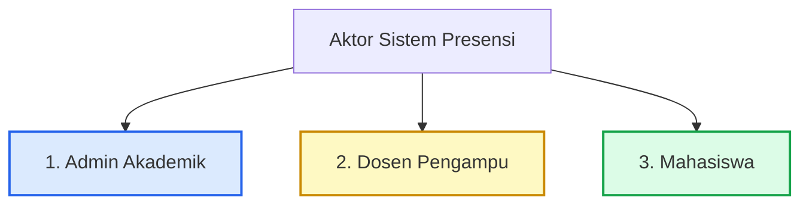
```mermaid
graph TD
    A[Aktor Sistem Presensi] --> Admin[1. Admin Akademik]
    A --> Dosen[2. Dosen Pengampu]
    A --> Mahasiswa[3. Mahasiswa]
    
    style Admin fill:#dbeafe,stroke:#2563eb,stroke-width:2px
    style Dosen fill:#fef9c3,stroke:#ca8a04,stroke-width:2px
    style Mahasiswa fill:#dcfce7,stroke:#16a34a,stroke-width:2px
```

1. **Admin Akademik**
   * **Karakteristik:** Staf sekretariat atau administrasi fakultas yang memiliki pemahaman teknis operasional data universitas.
   * **Strategi UI:** Layout desktop-first yang padat informasi, dashboard analitik dengan grafik jumlah data master, tabel data terstruktur dengan paginasi, pencarian, dan tombol aksi manipulasi data (CRUD).
   * **Peran:** Mengelola data master program studi, dosen, mahasiswa, mata kuliah, ruangan, tahun akademik, semester, serta pembagian kelas dan jadwal kuliah. Admin juga memiliki wewenang memverifikasi integritas hash data presensi jika dicurigai terjadi manipulasi.

2. **Dosen Pengampu**
   * **Karakteristik:** Tenaga pendidik yang memerlukan kecepatan akses saat berada di dalam ruang kelas. Mereka cenderung menyukai alur kerja yang minimalis agar tidak mengganggu jalannya perkuliahan.
   * **Strategi UI:** Tombol aksi yang mencolok dan besar (misalnya tombol hijau untuk "Buka Presensi" dan tombol merah untuk "Tutup Presensi"). Visual status kehadiran mahasiswa disajikan dalam bentuk badge warna agar mudah dipantau secara langsung di depan kelas.
   * **Peran:** Melihat jadwal mengajar harian, membuka sesi presensi, memantau absensi mahasiswa secara *real-time*, mengubah status kehadiran mahasiswa secara manual jika ada alasan khusus (Izin/Sakit), dan mengunduh laporan rekapitulasi kehadiran kelas.

3. **Mahasiswa**
   * **Karakteristik:** Pengguna yang aktif menggunakan perangkat mobile (smartphone/tablet). Mereka membutuhkan proses absensi yang instan saat berada di kelas tanpa perlu memasukkan data berulang.
   * **Strategi UI:** Desain responsif mobile-friendly. Tampilan halaman depan langsung menyajikan kartu jadwal kuliah hari ini. Tombol presensi mandiri hanya muncul jika sesi presensi telah diaktifkan oleh dosen dan waktu saat itu masih dalam batas toleransi.
   * **Peran:** Melihat jadwal kuliah mingguan, melakukan presensi mandiri (sekali klik) saat berada di kelas, dan melihat riwayat kehadiran serta persentase kehadiran per mata kuliah sebagai syarat kelayakan UAS.

---

#### 4.1.4 User Interface (UI)
User Interface dirancang dengan prinsip **Clean, Modern, dan Intuitive (Usability Tinggi)** untuk mendukung produktivitas pengguna dalam lingkungan akademis:

1. **Layout & Grid:** Menggunakan tata letak dua kolom (Sidebar Navigasi di sebelah kiri dan Area Konten Utama di sebelah kanan) untuk versi desktop. Layout akan bertransformasi menjadi satu kolom di perangkat mobile menggunakan CSS Flexbox dan Media Queries.
2. **Tipografi:** Menggunakan rumpun font sans-serif modern (seperti *Inter* atau *system-ui*) untuk memastikan teks berukuran kecil tetap terbaca dengan jelas pada tabel data yang padat.
3. **Skema Warna (Palette):**
   * **Warna Utama (Primary):** Deep Blue (`#0f172a` & `#2563eb`) mencerminkan profesionalitas dan kredibilitas akademis.
   * **Status Kehadiran (Badge):**
     * **Hadir:** Hijau (`#10b981`) -> Memberikan kesan positif dan sukses.
     * **Terlambat / Izin:** Kuning/Orange (`#f59e0b`) & Cyan (`#06b6d4`) -> Menunjukkan status peringatan atau memerlukan perhatian.
     * **Sakit:** Abu-abu (`#6b7280`) -> Menunjukkan status non-aktif sementara.
     * **Alpha:** Merah (`#ef4444`) -> Menunjukkan status kritis/tidak hadir tanpa keterangan.
4. **Minimalisasi Input:** Mahasiswa tidak perlu menginput data nama, NIM, atau mata kuliah secara manual saat melakukan absensi. Cukup menekan satu tombol "Hadir!" di panel jadwal aktif, dan sistem secara otomatis mendeteksi profil mahasiswa berdasarkan sesi login aktif.
5. **Instruksi Visual dan Tekstual:** Setiap aksi krusial dilengkapi dengan konfirmasi dialog (seperti saat dosen akan menutup sesi presensi yang akan memicu Auto-Alpha bagi mahasiswa lain).

---

#### 4.1.5 Fitur-Fitur Sistem
Fitur utama yang diimplementasikan pada sistem ini dirancang untuk mengamankan data dan mempermudah operasional kehadiran:

* **Autentikasi Multi-Role Aman:** Menggunakan enkripsi password berbasis SHA-256 untuk perlindungan data akun. Setiap level akses (`admin`, `dosen`, `mahasiswa`) dibatasi ketat oleh `SessionHelper` di setiap controller.
* **Pengaturan Toleransi Keterlambatan Per Jadwal:** Setiap jadwal mata kuliah dapat memiliki waktu toleransi keterlambatan yang berbeda (misalnya 15 menit untuk teori, 10 menit untuk praktikum). Status mahasiswa ditentukan secara dinamis berdasarkan kalkulasi milidetik waktu submit.
* **Mekanisme Auto-Alpha (Anti-Lupa):** Untuk menjaga integritas data statistik kehadiran, mahasiswa yang tidak melakukan presensi mandiri hingga sesi ditutup oleh dosen akan otomatis terisi dengan status `ALPHA` di database.
* **Audit Integritas Kriptografis (SHA-256 Integrity Verification):** Setiap baris kehadiran mahasiswa dilindungi oleh hash kriptografi SHA-256. Admin dapat mendeteksi manipulasi database yang dilakukan melalui tool eksternal (seperti phpMyAdmin atau SQL injection) dengan menekan tombol verifikasi yang membandingkan hash aktif dengan rekalkulasi data.
* **Pencetakan Rekapitulasi & Laporan PDF:** Menghasilkan rekapitulasi kehadiran per kelas secara keseluruhan dengan perhitungan persentase kehadiran otomatis bagi dosen dan staf admin.

---

#### 4.1.6 Analisis Data
Penganalisaan alur data meliputi input, proses, dan output pada sistem:

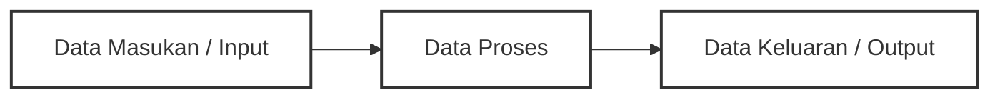
```mermaid
graph LR
    Input[Data Masukan / Input] --> Proses[Data Proses]
    Proses --> Output[Data Keluaran / Output]
    
    style Input fill:#fff,stroke:#333,stroke-width:2px
    style Proses fill:#fff,stroke:#333,stroke-width:2px
    style Output fill:#fff,stroke:#333,stroke-width:2px
```

1. **Data Masukan (Input Data):**
   * Data akun pengguna (Username, Password, Role).
   * Data akademik (Program Studi, Mata Kuliah, Dosen, Mahasiswa, Ruangan).
   * Data operasional kelas (Nama kelas, Kapasitas, Anggota kelas).
   * Data jadwal (Hari, Jam Mulai, Jam Selesai, Toleransi).
   * Data presensi (Tanggal pertemuan, Pertemuan ke-N, Keterangan).
   * Status kehadiran mahasiswa mandiri (Status `HADIR`, `TERLAMBAT`, Jam presensi).

2. **Data Proses (Process Data):**
   * Autentikasi user dan pengecekan otorisasi per halaman.
   * Perhitungan selisih menit antara waktu submit mahasiswa dengan jam mulai jadwal perkuliahan:
     $$\text{Selisih Menit} = \frac{\text{Waktu Absen} - \text{Waktu Mulai}}{60}$$
     * Jika $\text{Selisih Menit} \le \text{Toleransi Menit}$, status = `HADIR`.
     * Jika $\text{Toleransi Menit} < \text{Selisih Menit} \le 2 \times \text{Toleransi Menit}$, status = `TERLAMBAT`.
     * Jika $\text{Selisih Menit} > 2 \times \text{Toleransi Menit}$, status = `ALPHA`.
   * Sinkronisasi data anggota kelas yang tidak mengisi kehadiran untuk diubah menjadi `ALPHA` saat sesi presensi ditutup.
   * Pembuatan signature integritas data dengan SHA-256:
     $$\text{Hash Integrity} = \text{SHA256}(\text{NIM} \parallel \text{Kode MK} \parallel \text{Tanggal} \parallel \text{Status})$$
   * Perhitungan persentase kehadiran:
     $$\% \text{ Kehadiran} = \frac{\text{Hadir} + \text{Terlambat}}{\text{Total Pertemuan}} \times 100\%$$

3. **Data Keluaran (Output Data):**
   * Dashboard informasi ringkas data akademik.
   * Tampilan detail sesi presensi aktif dengan warna visual indikator.
   * Laporan rekapitulasi kehadiran per kelas berupa tabel kumulatif (Hadir, Sakit, Izin, Terlambat, Alpha).
   * Log verifikasi keutuhan data (Integritas data Valid atau Terjadi manipulasi).
   * Dokumen cetak laporan presensi kelas untuk kebutuhan arsip dosen.

---

#### 4.1.7 Analisis Biaya
Biaya pengembangan sistem informasi presensi perkuliahan ini diestimasikan sebagai berikut:

| No | Komponen Pengembangan | Kuantitas & Durasi | Estimasi Biaya (IDR) |
|----|-----------------------|-------------------|----------------------|
| 1  | System Analyst        | 1 Orang / 1 Bulan | Rp 8.000.000,00      |
| 2  | Web Programmer        | 1 Orang / 2 Bulan | Rp 14.000.000,00     |
| 3  | Pengadaan Server Lokal| 1 Unit            | Rp 10.000.000,00     |
| 4  | Hosting Cloud (VPS)   | 1 Tahun           | Rp 3.000.000,00      |
| 5  | Pelatihan Pengguna    | 2 Sesi (Staff/Dsn)| Rp 2.500.000,00      |
| 6  | Biaya Pemeliharaan    | 6 Bulan           | Rp 4.500.000,00      |
| **Total** | **Estimasi Biaya Sistem** |         | **Rp 42.000.000,00** |

---

### 4.2 PERANCANGAN SISTEM

#### 4.2.1 Diagram Arus Data (DAD) / UML

##### A. UML Use Case Diagram
Menggambarkan interaksi dari ketiga aktor utama (Admin Akademik, Dosen Pengampu, dan Mahasiswa) terhadap 10 fungsionalitas/alur utama sistem informasi presensi perkuliahan. Diagram ini menggunakan notasi UML standar dengan *stick figure* sebagai aktor, *ellipse* sebagai *use case*, *system boundary* sebagai batas sistem, dan relasi `<<include>>` untuk ketergantungan antar *use case*:

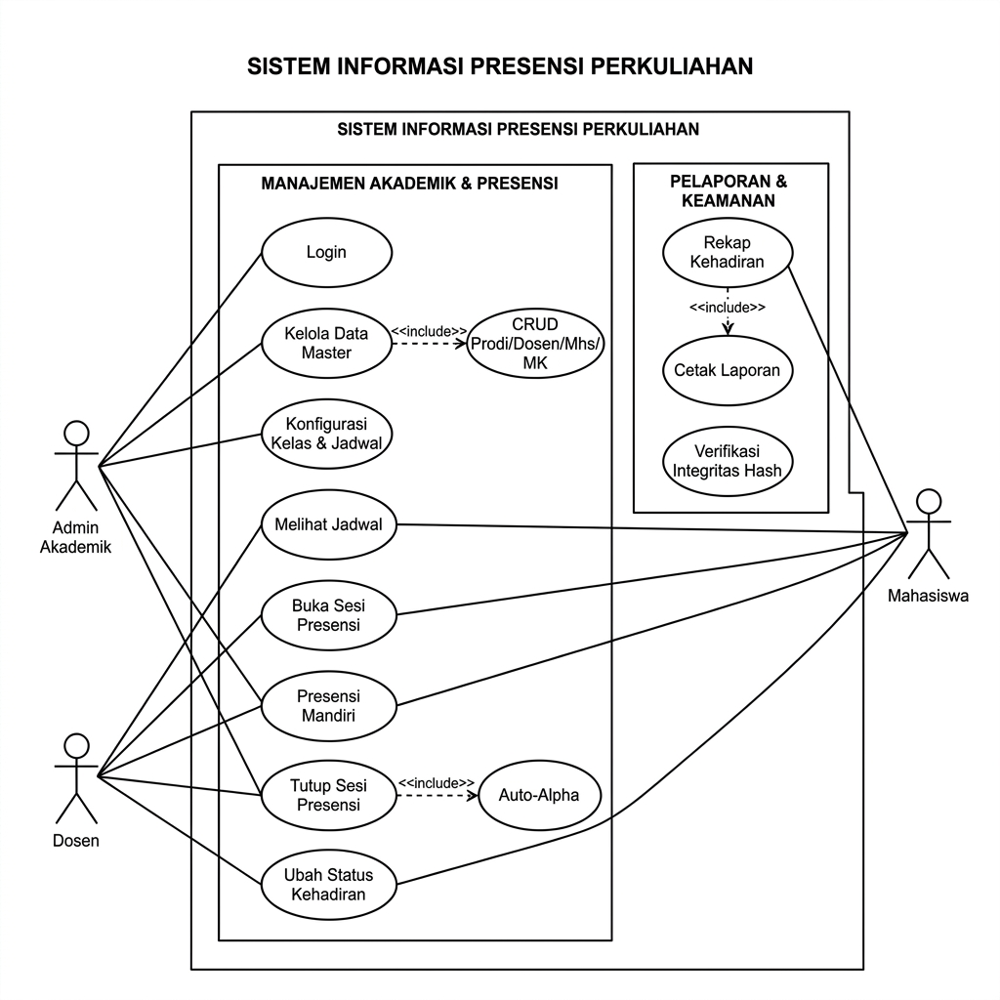

**Tabel Deskripsi Aktor:**

| No | Aktor | Deskripsi Peran & Hak Akses |
|:---:|:---|:---|
| 1 | **Admin Akademik** | Mengelola data master akademik, melakukan konfigurasi kelas & jadwal perkuliahan, memantau rekapitulasi kehadiran perkuliahan, serta mencetak laporan presensi. |
| 2 | **Dosen Pengampu** | Melihat jadwal mengajar, membuka dan menutup sesi presensi perkuliahan, melakukan ubah status kehadiran mahasiswa, memantau rekapitulasi kehadiran kelas yang diampu, serta mencetak laporan presensi. |
| 3 | **Mahasiswa** | Melihat jadwal perkuliahan pribadi, melakukan presensi mandiri saat sesi dibuka, serta memantau persentase dan rekapitulasi kehadiran pribadi. |

**Tabel Matriks Use Case yang Dapat Diakses:**

| Aktor | Use Case yang Dapat Diakses |
|-------|-----------------------------|
| **Admin Akademik** | Login, Kelola Data Master `<<include>>` CRUD Data Master, Konfigurasi Kelas & Jadwal, Rekap Kehadiran `<<include>>` Cetak Laporan PDF |
| **Dosen Pengampu** | Login, Melihat Jadwal Perkuliahan, Buka Sesi Presensi, Tutup Sesi Presensi `<<include>>` Auto-Alpha, Ubah Status Kehadiran, Rekap Kehadiran `<<include>>` Cetak Laporan PDF |
| **Mahasiswa** | Login, Melihat Jadwal Perkuliahan, Presensi Mandiri, Rekap Kehadiran |

##### B. Diagram Alir Data (DAD) Level 0 / Context Diagram
Menggambarkan batasan sistem secara keseluruhan dan aliran data antar entitas luar dengan sistem:

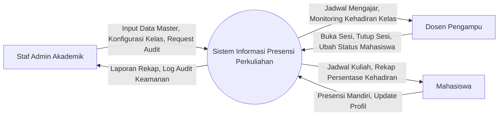
```mermaid
graph LR
    Admin[Staf Admin Akademik]
    System((Sistem Informasi Presensi Perkuliahan))
    Dosen[Dosen Pengampu]
    Mahasiswa[Mahasiswa]

    Admin -- "Input Data Master, Konfigurasi Kelas, Request Audit" --> System
    System -- "Laporan Rekap, Log Audit Keamanan" --> Admin

    Dosen -- "Buka Sesi, Tutup Sesi, Ubah Status Mahasiswa" --> System
    System -- "Jadwal Mengajar, Monitoring Kehadiran Kelas" --> Dosen

    Mahasiswa -- "Presensi Mandiri, Update Profil" --> System
    System -- "Jadwal Kuliah, Rekap Persentase Kehadiran" --> Mahasiswa
```

##### C. Diagram Alir Data (DAD) Level 1 (Proses Utama)
Menjelaskan proses internal sistem secara lebih mendalam beserta penyimpanan data (*data store*):

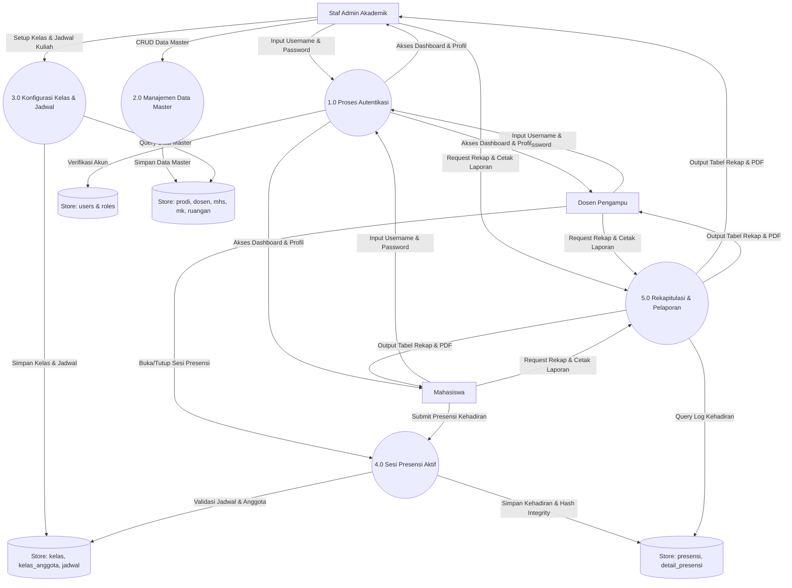
```mermaid
graph TB
    Admin[Staf Admin Akademik]
    Dosen[Dosen Pengampu]
    Mahasiswa[Mahasiswa]

    P1((1.0 Proses Autentikasi))
    P2((2.0 Manajemen Data Master))
    P3((3.0 Konfigurasi Kelas & Jadwal))
    P4((4.0 Sesi Presensi Aktif))
    P5((5.0 Rekapitulasi & Pelaporan))

    D1[(Store: users & roles)]
    D2[(Store: prodi, dosen, mhs, mk, ruangan)]
    D3[(Store: kelas, kelas_anggota, jadwal)]
    D4[(Store: presensi, detail_presensi)]

    %% 1.0 Autentikasi
    Admin & Dosen & Mahasiswa -- "Input Username & Password" --> P1
    P1 -- "Verifikasi Akun" --> D1
    P1 -- "Akses Dashboard & Profil" --> Admin & Dosen & Mahasiswa

    %% 2.0 Data Master
    Admin -- "CRUD Data Master" --> P2
    P2 -- "Simpan Data Master" --> D2

    %% 3.0 Kelas & Jadwal
    Admin -- "Setup Kelas & Jadwal Kuliah" --> P3
    P3 -- "Query Data Master" --> D2
    P3 -- "Simpan Kelas & Jadwal" --> D3

    %% 4.0 Sesi Presensi
    Dosen -- "Buka/Tutup Sesi Presensi" --> P4
    Mahasiswa -- "Submit Presensi Kehadiran" --> P4
    P4 -- "Validasi Jadwal & Anggota" --> D3
    P4 -- "Simpan Kehadiran & Hash Integrity" --> D4

    %% 5.0 Rekap & Laporan
    Admin & Dosen & Mahasiswa -- "Request Rekap & Cetak Laporan" --> P5
    P5 -- "Query Log Kehadiran" --> D4
    P5 -- "Output Tabel Rekap & PDF" --> Admin & Dosen & Mahasiswa
```

##### D. UML Class Diagram
Menunjukkan relasi antar kelas controller dan model yang digunakan di dalam sistem presensi:

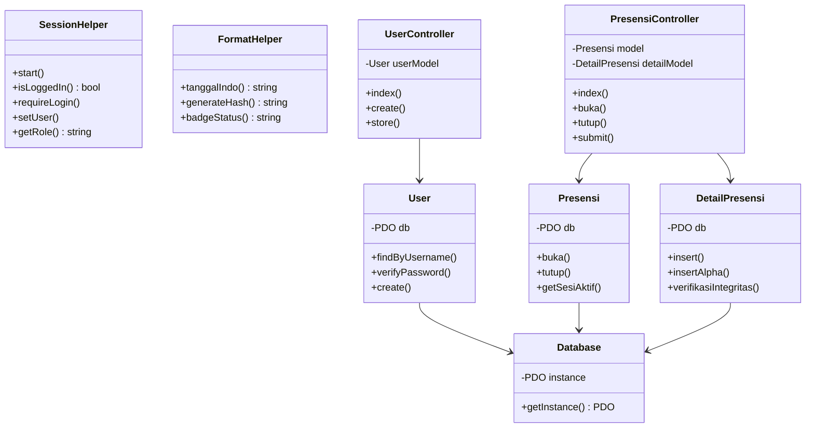
```mermaid
classDiagram
    class Database {
        -PDO instance
        +getInstance() PDO
    }
    class SessionHelper {
        +start()
        +isLoggedIn() bool
        +requireLogin()
        +setUser()
        +getRole() string
    }
    class FormatHelper {
        +tanggalIndo() string
        +generateHash() string
        +badgeStatus() string
    }
    class UserController {
        -User userModel
        +index()
        +create()
        +store()
    }
    class PresensiController {
        -Presensi model
        -DetailPresensi detailModel
        +index()
        +buka()
        +tutup()
        +submit()
    }
    class User {
        -PDO db
        +findByUsername()
        +verifyPassword()
        +create()
    }
    class Presensi {
        -PDO db
        +buka()
        +tutup()
        +getSesiAktif()
    }
    class DetailPresensi {
        -PDO db
        +insert()
        +insertAlpha()
        +verifikasiIntegritas()
    }

    UserController --> User
    PresensiController --> Presensi
    PresensiController --> DetailPresensi
    User --> Database
    Presensi --> Database
    DetailPresensi --> Database
```

##### E. UML Activity Diagram
Menggambarkan alur aktivitas (langkah-langkah proses) yang dilakukan aktor di dalam sistem dari awal hingga selesai. Diagram ini menggunakan format **IPO (Input – Proses – Output)** dengan *swimlane* vertikal yang memisahkan tindakan pengguna, pemrosesan sistem, dan keluaran yang ditampilkan:

**E.1. Activity Diagram: Proses Login**

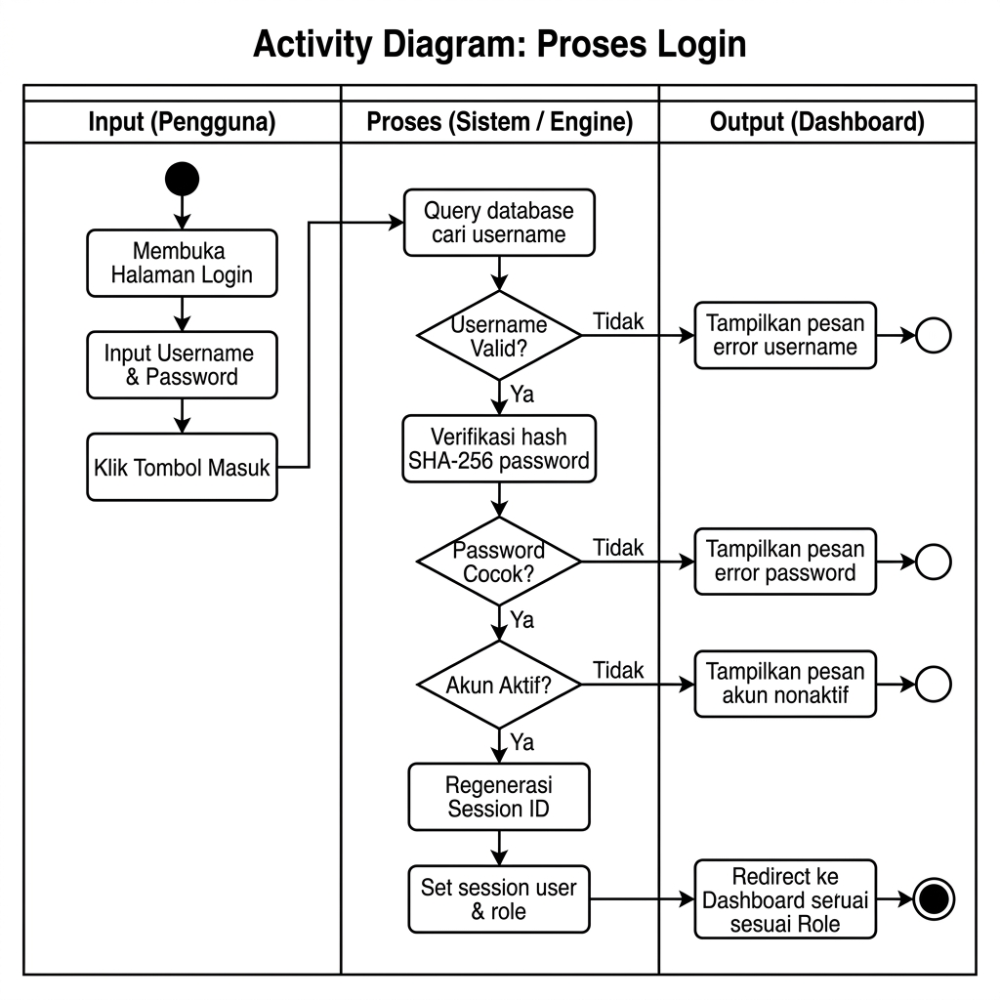

**E.2. Activity Diagram: Membuka Sesi Presensi (Dosen)**

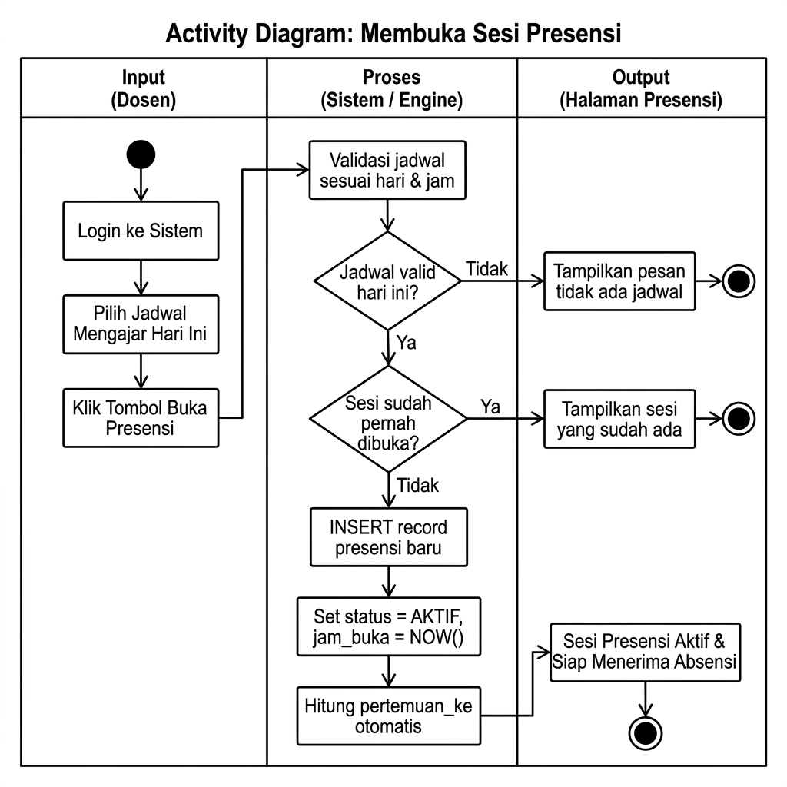

**E.3. Activity Diagram: Presensi Mandiri Mahasiswa**

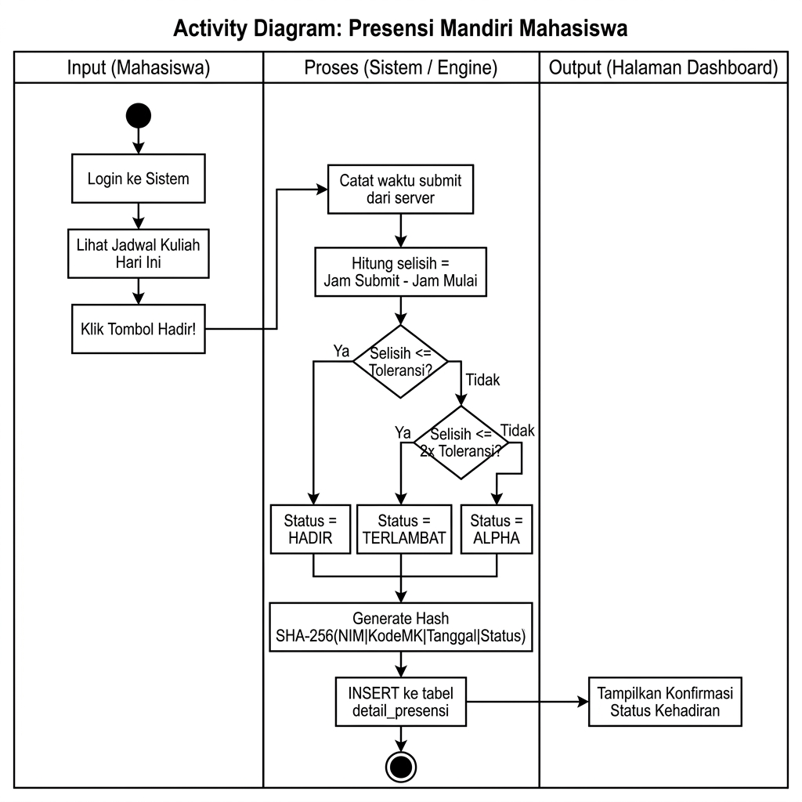

**E.4. Activity Diagram: Menutup Sesi Presensi & Auto-Alpha (Dosen)**

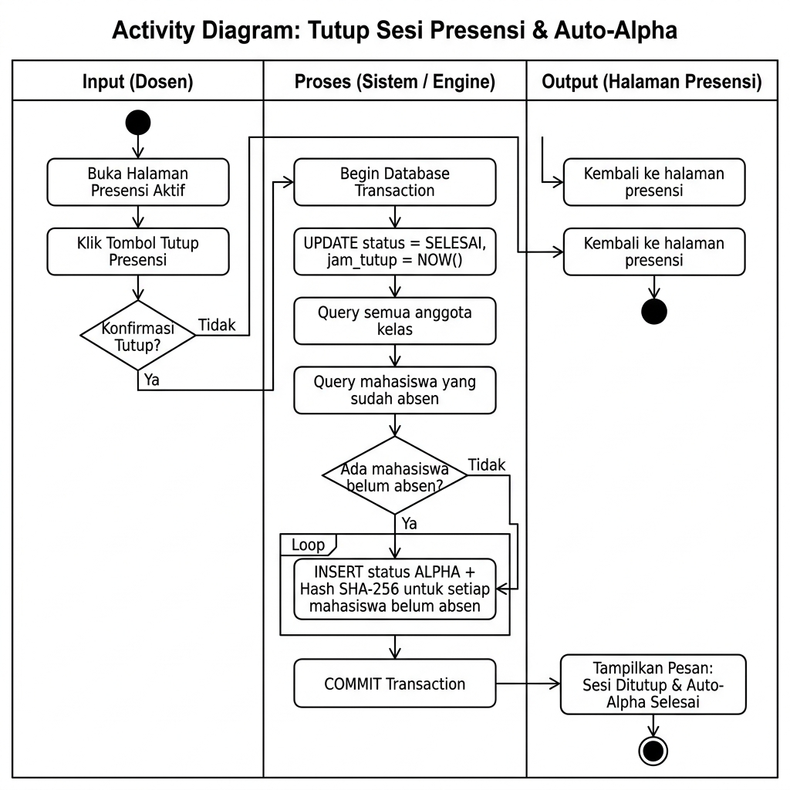

**E.5. Activity Diagram: Kelola Data Master (CRUD - Admin)**

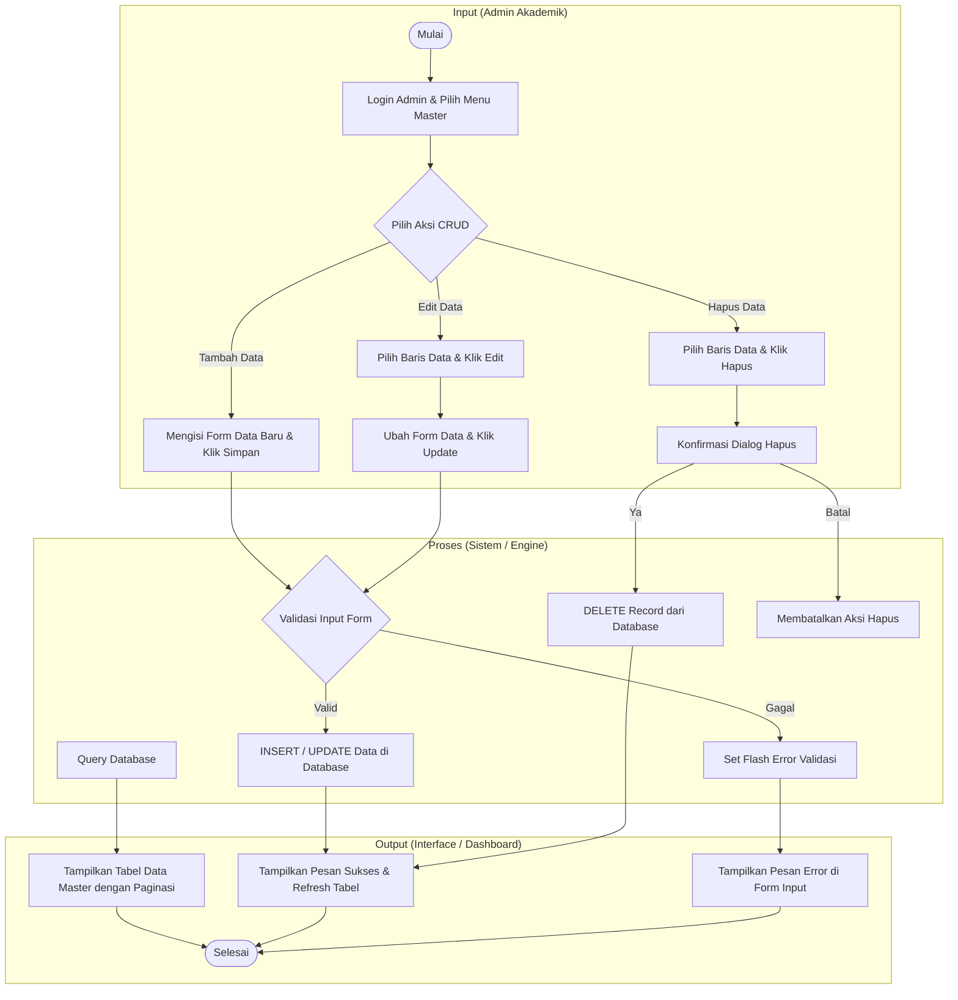
```mermaid
flowchart TD
    subgraph Input ["Input (Admin Akademik)"]
        In1([Mulai]) --> In2[Login Admin & Pilih Menu Master]
        In2 --> In3{Pilih Aksi CRUD}
        In3 -- Tambah Data --> In4[Mengisi Form Data Baru & Klik Simpan]
        In3 -- Edit Data --> In5[Pilih Baris Data & Klik Edit]
        In3 -- Hapus Data --> In6[Pilih Baris Data & Klik Hapus]
        In5 --> In7[Ubah Form Data & Klik Update]
        In6 --> In8[Konfirmasi Dialog Hapus]
    end

    subgraph Proses ["Proses (Sistem / Engine)"]
        P1[Query Database]
        In4 --> P2{Validasi Input Form}
        In7 --> P2
        In8 -- Ya --> P3[DELETE Record dari Database]
        In8 -- Batal --> P4[Membatalkan Aksi Hapus]
        P2 -- Valid --> P5[INSERT / UPDATE Data di Database]
        P2 -- Gagal --> P6[Set Flash Error Validasi]
    end

    subgraph Output ["Output (Interface / Dashboard)"]
        P1 --> Out1[Tampilkan Tabel Data Master dengan Paginasi]
        P5 --> Out2[Tampilkan Pesan Sukses & Refresh Tabel]
        P3 --> Out2
        P6 --> Out3[Tampilkan Pesan Error di Form Input]
        Out1 --> OutEnd([Selesai])
        Out2 --> OutEnd
        Out3 --> OutEnd
    end
```

**E.6. Activity Diagram: Konfigurasi Kelas & Anggota Kelas (Admin)**

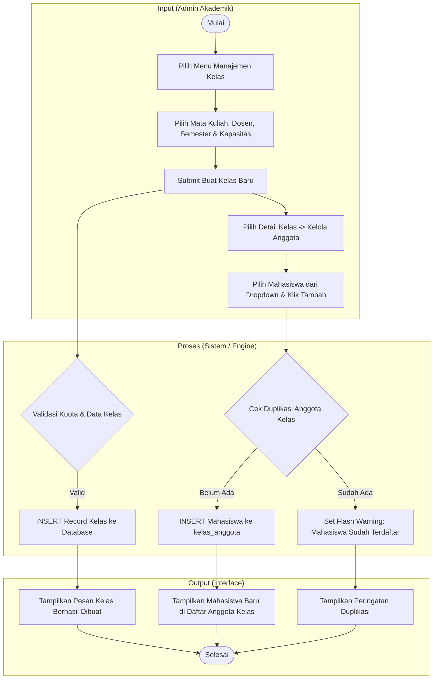
```mermaid
flowchart TD
    subgraph Input ["Input (Admin Akademik)"]
        In1([Mulai]) --> In2[Pilih Menu Manajemen Kelas]
        In2 --> In3[Pilih Mata Kuliah, Dosen, Semester & Kapasitas]
        In3 --> In4[Submit Buat Kelas Baru]
        In4 --> In5[Pilih Detail Kelas -> Kelola Anggota]
        In5 --> In6[Pilih Mahasiswa dari Dropdown & Klik Tambah]
    end

    subgraph Proses ["Proses (Sistem / Engine)"]
        In4 --> P1{Validasi Kuota & Data Kelas}
        P1 -- Valid --> P2[INSERT Record Kelas ke Database]
        In6 --> P3{Cek Duplikasi Anggota Kelas}
        P3 -- Belum Ada --> P4[INSERT Mahasiswa ke kelas_anggota]
        P3 -- Sudah Ada --> P5[Set Flash Warning: Mahasiswa Sudah Terdaftar]
    end

    subgraph Output ["Output (Interface)"]
        P2 --> Out1[Tampilkan Pesan Kelas Berhasil Dibuat]
        P4 --> Out2[Tampilkan Mahasiswa Baru di Daftar Anggota Kelas]
        P5 --> Out3[Tampilkan Peringatan Duplikasi]
        Out1 --> OutEnd([Selesai])
        Out2 --> OutEnd
        Out3 --> OutEnd
    end
```

**E.7. Activity Diagram: Ubah Status Kehadiran Manual (Dosen)**

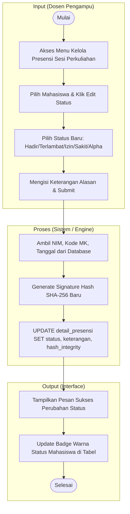
```mermaid
flowchart TD
    subgraph Input ["Input (Dosen Pengampu)"]
        In1([Mulai]) --> In2[Akses Menu Kelola Presensi Sesi Perkuliahan]
        In2 --> In3[Pilih Mahasiswa & Klik Edit Status]
        In3 --> In4[Pilih Status Baru: Hadir/Terlambat/Izin/Sakit/Alpha]
        In4 --> In5[Mengisi Keterangan Alasan & Submit]
    end

    subgraph Proses ["Proses (Sistem / Engine)"]
        In5 --> P1[Ambil NIM, Kode MK, Tanggal dari Database]
        P1 --> P2[Generate Signature Hash SHA-256 Baru]
        P2 --> P3[UPDATE detail_presensi SET status, keterangan, hash_integrity]
    end

    subgraph Output ["Output (Interface)"]
        P3 --> Out1[Tampilkan Pesan Sukses Perubahan Status]
        Out1 --> Out2[Update Badge Warna Status Mahasiswa di Tabel]
        Out2 --> OutEnd([Selesai])
    end
```

**E.8. Activity Diagram: Rekapitulasi & Pelaporan Kehadiran**

```mermaid
flowchart TD
    subgraph Input ["Input (Dosen / Admin / Mahasiswa)"]
        In1([Mulai]) --> In2[Akses Menu Laporan Rekapitulasi]
        In2 --> In3{Pilih Filter Laporan}
        In3 -- Dosen/Admin --> In4[Pilih Kelas Perkuliahan]
        In3 -- Mahasiswa --> In5[Pilih Mata Kuliah & Semester]
        In4 --> In6[Klik Tampilkan Rekap / Klik Export Cetak PDF]
        In5 --> In6
    end

    subgraph Proses ["Proses (Sistem / Engine)"]
        In6 --> P1[Query Total Sesi Pertemuan & Log detail_presensi]
        P1 --> P2["Kalkulasi % Kehadiran = (Hadir + Terlambat) / Total Sesi * 100%"]
        P2 --> P3{Cek Ambang Kelayakan UAS (< 75%)}
        P3 -- Ya --> P4[Tandai Flag Peringatan UAS]
        P3 -- Tidak --> P5[Status Kehadiran Aman]
    end

    subgraph Output ["Output (Interface / File)"]
        P4 & P5 --> Out1[Tampilkan Tabel Matrix Kehadiran Pertemuan 1-16]
        Out1 --> Out2{Opsi Cetak?}
        Out2 -- Ya --> Out3[Generate Format Cetak Laporan PDF/Print]
        Out2 -- Tidak --> OutEnd([Selesai])
        Out3 --> OutEnd
    end
```

**E.9. Activity Diagram: Verifikasi Integritas Data Hash SHA-256 (Admin)**

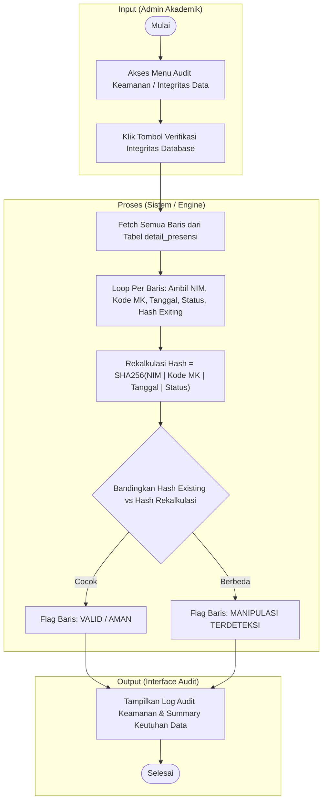
```mermaid
flowchart TD
    subgraph Input ["Input (Admin Akademik)"]
        In1([Mulai]) --> In2[Akses Menu Audit Keamanan / Integritas Data]
        In2 --> In3[Klik Tombol Verifikasi Integritas Database]
    end

    subgraph Proses ["Proses (Sistem / Engine)"]
        In3 --> P1[Fetch Semua Baris dari Tabel detail_presensi]
        P1 --> P2[Loop Per Baris: Ambil NIM, Kode MK, Tanggal, Status, Hash Exiting]
        P2 --> P3["Rekalkulasi Hash = SHA256(NIM | Kode MK | Tanggal | Status)"]
        P3 --> P4{Bandingkan Hash Existing vs Hash Rekalkulasi}
        P4 -- Cocok --> P5[Flag Baris: VALID / AMAN]
        P4 -- Berbeda --> P6[Flag Baris: MANIPULASI TERDETEKSI]
    end

    subgraph Output ["Output (Interface Audit)"]
        P5 & P6 --> Out1[Tampilkan Log Audit Keamanan & Summary Keutuhan Data]
        Out1 --> OutEnd([Selesai])
    end
```

---

##### F. UML Sequence Diagram
Menggambarkan urutan interaksi antar objek (aktor, controller, model, dan database) secara kronologis:

**F.1. Sequence Diagram: Proses Login Multi-Role**


**Gambar 4.12 Sequence Diagram Proses Login**

Alur interaksi login dimulai ketika pengguna (Admin/Dosen/Mahasiswa) mengakses halaman login dan memasukkan username serta password melalui View `login.php`. Data kredensial kemudian diteruskan melalui request `POST /login` kepada `AuthController`. Selanjutnya, `AuthController` memanggil `Model User` untuk mencari data pengguna berdasarkan username melalui `findByUsername()`. Jika pengguna ditemukan, sistem memverifikasi kesesuaian password menggunakan `verifyPassword()` dan memeriksa status akun `is_active`. Setelah seluruh validasi berhasil, `session_regenerate_id(true)` dipanggil untuk mencegah serangan *Session Fixation*, kemudian sistem mengambil data profil berdasarkan *role* pengguna dan menetapkan sesi melalui `SessionHelper::setUser()`.


**F.2. Sequence Diagram: Proses Presensi Mandiri Mahasiswa**

Diagram urutan ini memodelkan proses pengisian presensi secara mandiri oleh mahasiswa melalui dashboard sistem. Alur ini menggambarkan interaksi antara Mahasiswa, View Dashboard, `PresensiController`, `Model Jadwal`, `Model Presensi`, `Model DetailPresensi`, `FormatHelper`, dan basis data MySQL dalam menampilkan sesi aktif, menentukan status kehadiran berdasarkan toleransi waktu, serta membentuk *integrity hash SHA-256*.


**Gambar 4.13 Sequence Diagram Presensi Mandiri Mahasiswa**

Alur interaksi presensi dimulai ketika mahasiswa mengakses dashboard dan sistem meminta jadwal mahasiswa melalui `PresensiController`. Selanjutnya, `PresensiController` memanggil `Model Jadwal` untuk mengambil jadwal pada hari tersebut dari basis data, kemudian memeriksa sesi presensi aktif melalui `Model Presensi`. Apabila sesi tersedia, sistem menampilkan tombol **Hadir!** kepada mahasiswa. Ketika tombol tersebut ditekan, permintaan `POST submit(presensi_id)` diteruskan kepada `PresensiController`, kemudian sistem mengambil waktu server dan nilai toleransi dari jadwal untuk menghitung selisih waktu kedatangan, menetapkan status kehadiran (`HADIR`, `TERLAMBAT`, atau `ALPHA`), membentuk *integrity hash SHA-256*, dan menampilkan konfirmasi keberhasilan kepada mahasiswa.


**F.3. Sequence Diagram: Membuka Sesi Presensi (Dosen)**

Diagram urutan ini memodelkan proses pembukaan sesi presensi yang dilakukan oleh Dosen berdasarkan jadwal perkuliahan yang tersedia. Alur ini menggambarkan interaksi antara Dosen, halaman jadwal, `PresensiController`, `Model Jadwal`, `Model Presensi`, dan basis data MySQL dalam melakukan validasi jadwal serta membuat sesi presensi baru.


**Gambar 4.14 Sequence Diagram Membuka Sesi Presensi (Dosen)**

Alur interaksi dimulai ketika Dosen memilih jadwal perkuliahan dan menekan tombol **Buka Presensi** melalui View Jadwal Dosen. Permintaan tersebut kemudian diteruskan melalui `POST buka(jadwal_id, pertemuan_ke, keterangan)` kepada `PresensiController`. Selanjutnya, `PresensiController` memanggil `Model Jadwal` untuk melakukan validasi terhadap `jadwal_id`, yang diteruskan dengan kueri ke basis data untuk mengambil informasi jadwal terkait (`kelas_id`, `toleransi_menit`). Setelah validasi berhasil, `PresensiController` memanggil `Model Presensi` untuk membuat sesi presensi baru dengan status `AKTIF` dan mencatat `jam_buka = NOW()`. Sistem kemudian menampilkan pesan sukses dan mengarahkan Dosen ke halaman kelola presensi.


**F.4. Sequence Diagram: Proses Tutup Sesi & Auto-Alpha (Dosen)**

Diagram urutan ini memodelkan proses penutupan sesi presensi oleh Dosen beserta eksekusi transaksi otomatis *Auto-Alpha* yang mengisi status `ALPHA` bagi mahasiswa yang belum melakukan presensi mandiri.


**Gambar 4.15 Sequence Diagram Tutup Sesi & Auto-Alpha (Dosen)**

Alur interaksi dimulai ketika Dosen menekan tombol **Tutup Presensi** pada halaman kelola presensi kelas. Permintaan diteruskan melalui `tutup(presensi_id)` kepada `PresensiController`, yang kemudian mengambil data sesi melalui `Model Presensi`. Sistem memulai transaksi database (`beginTransaction`), mengubah status sesi menjadi `SELESAI` dan mencatat `jam_tutup = NOW()`. Selanjutnya, algoritma *set difference* dijalankan dengan mengambil seluruh anggota kelas melalui `Model Kelas` dan membandingkannya dengan daftar mahasiswa yang sudah absen. Setiap mahasiswa yang tidak ditemukan dalam daftar absensi secara otomatis dimasukkan ke `detail_presensi` dengan status `ALPHA` beserta *integrity hash SHA-256*. Jika seluruh proses berhasil, transaksi di-`commit`; jika terjadi kesalahan, transaksi di-`rollBack`.


---

##### G. UML State Diagram
Menggambarkan perubahan status (state) dari suatu objek berdasarkan event yang terjadi di dalam sistem:

**G.1. State Diagram: Status Sesi Presensi**

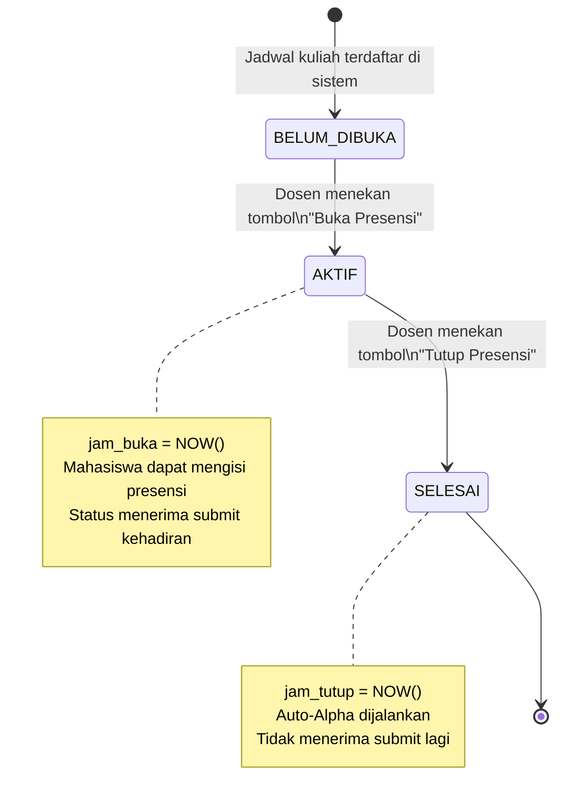
```mermaid
stateDiagram-v2
    [*] --> BELUM_DIBUKA : Jadwal kuliah terdaftar di sistem

    BELUM_DIBUKA --> AKTIF : Dosen menekan tombol\n"Buka Presensi"
    note right of AKTIF
        jam_buka = NOW()
        Mahasiswa dapat mengisi presensi
        Status menerima submit kehadiran
    end note

    AKTIF --> SELESAI : Dosen menekan tombol\n"Tutup Presensi"
    note right of SELESAI
        jam_tutup = NOW()
        Auto-Alpha dijalankan
        Tidak menerima submit lagi
    end note

    SELESAI --> [*]
```

**G.2. State Diagram: Status Kehadiran Mahasiswa (per Sesi Presensi)**

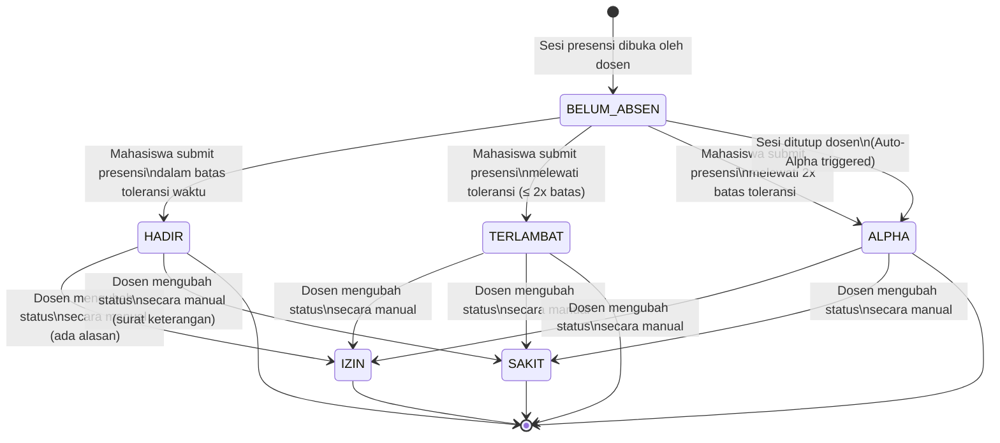
```mermaid
stateDiagram-v2
    [*] --> BELUM_ABSEN : Sesi presensi dibuka oleh dosen

    BELUM_ABSEN --> HADIR : Mahasiswa submit presensi\ndalam batas toleransi waktu
    BELUM_ABSEN --> TERLAMBAT : Mahasiswa submit presensi\nmelewati toleransi (≤ 2x batas)
    BELUM_ABSEN --> ALPHA : Mahasiswa submit presensi\nmelewati 2x batas toleransi
    BELUM_ABSEN --> ALPHA : Sesi ditutup dosen\n(Auto-Alpha triggered)

    HADIR --> IZIN : Dosen mengubah status\nsecara manual (ada alasan)
    HADIR --> SAKIT : Dosen mengubah status\nsecara manual (surat keterangan)

    TERLAMBAT --> IZIN : Dosen mengubah status\nsecara manual
    TERLAMBAT --> SAKIT : Dosen mengubah status\nsecara manual

    ALPHA --> IZIN : Dosen mengubah status\nsecara manual
    ALPHA --> SAKIT : Dosen mengubah status\nsecara manual

    HADIR --> [*]
    TERLAMBAT --> [*]
    ALPHA --> [*]
    IZIN --> [*]
    SAKIT --> [*]
```

---

#### 4.2.2 Entity Relationship Diagram (ERD)
ERD dari database `sistem_presensi` yang terdiri dari 14 entitas dan relasi antartabel dengan integritas kunci asing (Foreign Keys):

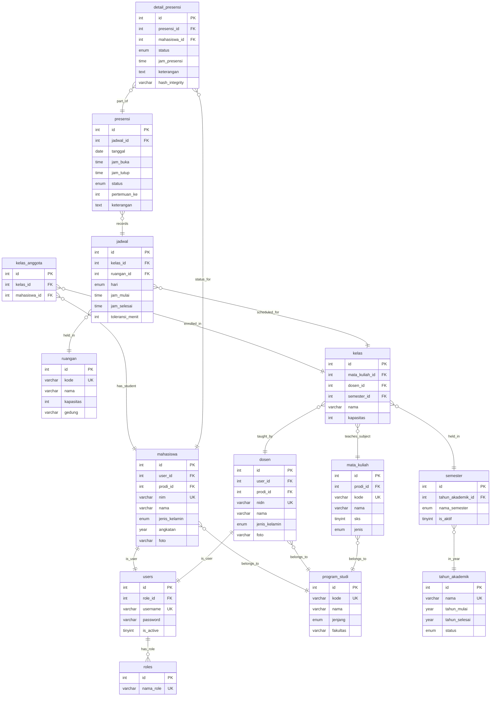
```mermaid
erDiagram
    roles {
        int id PK
        varchar nama_role UK
    }
    users {
        int id PK
        int role_id FK
        varchar username UK
        varchar password
        tinyint is_active
    }
    program_studi {
        int id PK
        varchar kode UK
        varchar nama
        enum jenjang
        varchar fakultas
    }
    tahun_akademik {
        int id PK
        varchar nama UK
        year tahun_mulai
        year tahun_selesai
        enum status
    }
    semester {
        int id PK
        int tahun_akademik_id FK
        enum nama_semester
        tinyint is_aktif
    }
    mahasiswa {
        int id PK
        int user_id FK
        int prodi_id FK
        varchar nim UK
        varchar nama
        enum jenis_kelamin
        year angkatan
        varchar foto
    }
    dosen {
        int id PK
        int user_id FK
        int prodi_id FK
        varchar nidn UK
        varchar nama
        enum jenis_kelamin
        varchar foto
    }
    mata_kuliah {
        int id PK
        int prodi_id FK
        varchar kode UK
        varchar nama
        tinyint sks
        enum jenis
    }
    ruangan {
        int id PK
        varchar kode UK
        varchar nama
        int kapasitas
        varchar gedung
    }
    kelas {
        int id PK
        int mata_kuliah_id FK
        int dosen_id FK
        int semester_id FK
        varchar nama
        int kapasitas
    }
    kelas_anggota {
        int id PK
        int kelas_id FK
        int mahasiswa_id FK
    }
    jadwal {
        int id PK
        int kelas_id FK
        int ruangan_id FK
        enum hari
        time jam_mulai
        time jam_selesai
        int toleransi_menit
    }
    presensi {
        int id PK
        int jadwal_id FK
        date tanggal
        time jam_buka
        time jam_tutup
        enum status
        int pertemuan_ke
        text keterangan
    }
    detail_presensi {
        int id PK
        int presensi_id FK
        int mahasiswa_id FK
        enum status
        time jam_presensi
        text keterangan
        varchar hash_integrity
    }

    users ||--o{ roles : "has_role"
    mahasiswa ||--|| users : "is_user"
    dosen ||--|| users : "is_user"
    mahasiswa }o--|| program_studi : "belongs_to"
    dosen }o--|| program_studi : "belongs_to"
    mata_kuliah }o--|| program_studi : "belongs_to"
    semester }o--|| tahun_akademik : "in_year"
    kelas }o--|| mata_kuliah : "teaches_subject"
    kelas }o--|| dosen : "taught_by"
    kelas }o--|| semester : "held_in"
    kelas_anggota }o--|| kelas : "enrolled_in"
    kelas_anggota }o--|| mahasiswa : "has_student"
    jadwal }o--|| kelas : "scheduled_for"
    jadwal }o--|| ruangan : "held_in"
    presensi }o--|| jadwal : "records"
    detail_presensi }o--|| presensi : "part_of"
    detail_presensi }o--|| mahasiswa : "status_for"
```

---

#### 4.2.3 Normalisasi

##### A. Unnormalized Form (UNF)
Pada tahap ini, semua data mahasiswa, dosen, mata kuliah, jadwal, dan riwayat presensi berada dalam satu dokumen datar/flat tabel dengan data yang berulang-ulang (*redundant*):

```text
[NIM, NamaMahasiswa, JenisKelaminMhs, Angkatan, KodeProdi, NamaProdi, Fakultas, NIDN, NamaDosen, KodeMK, NamaMK, SKS, KodeRuangan, NamaRuangan, NamaKelas, NamaSemester, TahunAkademik, TanggalPresensi, PertemuanKe, JamBuka, StatusKehadiran, JamPresensi, HashIntegrity]
```

##### B. Normalisasi Pertama (1NF)
Menghilangkan kelompok data berulang (*repeating groups*) dan memastikan setiap atribut bersifat atomik. Setiap baris mewakili satu kejadian presensi mahasiswa pada pertemuan kuliah tertentu:

* **Aturan 1NF:** Seluruh atribut bernilai tunggal pada perpotongan baris dan kolom. Kunci kandidat utama adalah kombinasi `(NIM, KodeMK, TanggalPresensi, PertemuanKe)`. Namun, tabel masih mengalami redundansi parah pada informasi program studi, dosen, dan mata kuliah.

##### C. Normalisasi Kedua (2NF)
Menghilangkan ketergantungan parsial (*partial dependencies*). Semua atribut non-key harus bergantung sepenuhnya pada kunci primer. Data dipecah menjadi beberapa entitas logis berdasarkan domainnya:

* **Tabel Mahasiswa:** `(NIM [PK], Nama, JenisKelamin, Angkatan, KodeProdi)` -> Atribut bergantung penuh pada `NIM`.
* **Tabel Dosen:** `(NIDN [PK], Nama, JenisKelamin, KodeProdi)` -> Atribut bergantung penuh pada `NIDN`.
* **Tabel Mata Kuliah:** `(KodeMK [PK], NamaMK, SKS, Jenis, KodeProdi)` -> Atribut bergantung penuh pada `KodeMK`.
* **Tabel Ruangan:** `(KodeRuangan [PK], NamaRuangan, Kapasitas, Gedung)` -> Atribut bergantung penuh pada `KodeRuangan`.
* **Tabel Kelas:** `(IDKelas [PK], KodeMK, NIDN, IDSemester, NamaKelas, Kapasitas)`.

##### D. Normalisasi Ketiga (3NF)
Menghilangkan ketergantungan transitif (*transitive dependencies*), di mana atribut non-key tidak boleh bergantung pada atribut non-key lainnya.

* **Sebelum 3NF:** Pada tabel mahasiswa terdapat kolom `Fakultas` yang bergantung pada `KodeProdi`, padahal `KodeProdi` bergantung pada `NIM` (transitif: $\text{NIM} \rightarrow \text{KodeProdi} \rightarrow \text{Fakultas}$).
* **Solusi 3NF:** Fakultas dipindahkan ke tabel tersendiri yaitu **Tabel Program Studi** `(KodeProdi [PK], NamaProdi, Jenjang, Fakultas)`. Sekarang, tabel mahasiswa hanya merujuk pada kunci asing `KodeProdi` untuk melacak prodi dan fakultasnya. Hal yang sama juga diterapkan pada tabel `users` & `roles`, serta `semester` & `tahun_akademik`.

---

#### 4.2.4 Struktur Tabel
Berikut adalah detail struktur fisik dari tabel-tabel utama yang menyusun database `sistem_presensi`:

##### 1. Tabel: `users`
Menyimpan akun login untuk seluruh aktor sistem.
| Field | Tipe Data | Null | Key | Default | Keterangan |
|-------|-----------|------|-----|---------|------------|
| id | INT | NO | PRI | NULL | Auto Increment |
| role_id | INT | NO | MUL | NULL | Foreign Key ke tabel roles |
| username | VARCHAR(50) | NO | UNI | NULL | Nama pengguna untuk login |
| password | VARCHAR(255) | NO | | NULL | Hashed Password (SHA-256) |
| is_active | TINYINT(1) | NO | | 1 | Status akun (1=Aktif, 0=Nonaktif) |
| created_at| TIMESTAMP | NO | | CURRENT_TIMESTAMP | Waktu pendaftaran |

##### 2. Tabel: `mahasiswa`
Menyimpan data profil dari mahasiswa.
| Field | Tipe Data | Null | Key | Default | Keterangan |
|-------|-----------|------|-----|---------|------------|
| id | INT | NO | PRI | NULL | Auto Increment |
| user_id | INT | NO | UNI | NULL | Relasi 1-to-1 ke users |
| prodi_id | INT | NO | MUL | NULL | FK ke program_studi |
| nim | VARCHAR(20) | NO | UNI | NULL | Nomor Induk Mahasiswa |
| nama | VARCHAR(100)| NO | | NULL | Nama Lengkap Mahasiswa |
| jenis_kelamin| ENUM('L','P')| NO | | NULL | Jenis Kelamin |
| angkatan | YEAR | NO | | NULL | Tahun Masuk Kuliah |
| foto | VARCHAR(255)| YES| | NULL | Nama file foto profil |

##### 3. Tabel: `dosen`
Menyimpan data profil dari dosen.
| Field | Tipe Data | Null | Key | Default | Keterangan |
|-------|-----------|------|-----|---------|------------|
| id | INT | NO | PRI | NULL | Auto Increment |
| user_id | INT | NO | UNI | NULL | Relasi 1-to-1 ke users |
| prodi_id | INT | NO | MUL | NULL | FK ke program_studi |
| nidn | VARCHAR(20) | NO | UNI | NULL | Nomor Induk Dosen Nasional |
| nama | VARCHAR(100)| NO | | NULL | Nama Lengkap Dosen |
| jenis_kelamin| ENUM('L','P')| NO | | NULL | Jenis Kelamin |
| foto | VARCHAR(255)| YES| | NULL | Nama file foto profil |

##### 4. Tabel: `kelas`
Menghubungkan mata kuliah dengan dosen pengajar pada semester tertentu.
| Field | Tipe Data | Null | Key | Default | Keterangan |
|-------|-----------|------|-----|---------|------------|
| id | INT | NO | PRI | NULL | Auto Increment |
| mata_kuliah_id| INT | NO | MUL | NULL | FK ke mata_kuliah |
| dosen_id | INT | NO | MUL | NULL | FK ke dosen |
| semester_id | INT | NO | MUL | NULL | FK ke semester |
| nama | VARCHAR(10) | NO | | NULL | Nama Kelas (A, B, C, dst) |
| kapasitas | INT | NO | | 40 | Kapasitas kursi maksimal |

##### 5. Tabel: `jadwal`
Menyimpan detail hari, jam, dan lokasi ruangan kelas.
| Field | Tipe Data | Null | Key | Default | Keterangan |
|-------|-----------|------|-----|---------|------------|
| id | INT | NO | PRI | NULL | Auto Increment |
| kelas_id | INT | NO | MUL | NULL | FK ke kelas |
| ruangan_id| INT | NO | MUL | NULL | FK ke ruangan |
| hari | ENUM(...) | NO | | NULL | Hari kuliah (Senin-Sabtu) |
| jam_mulai | TIME | NO | | NULL | Jam Masuk Kuliah |
| jam_selesai| TIME | NO | | NULL | Jam Keluar Kuliah |
| toleransi_menit| INT | NO | | 15 | Batas Keterlambatan (menit) |

##### 6. Tabel: `presensi`
Menampung sesi pertemuan perkuliahan yang dibuat oleh dosen.
| Field | Tipe Data | Null | Key | Default | Keterangan |
|-------|-----------|------|-----|---------|------------|
| id | INT | NO | PRI | NULL | Auto Increment |
| jadwal_id | INT | NO | MUL | NULL | FK ke jadwal |
| tanggal | DATE | NO | | NULL | Tanggal pertemuan |
| jam_buka | TIME | YES| | NULL | Jam dosen membuka sesi |
| jam_tutup | TIME | YES| | NULL | Jam sesi ditutup |
| status | ENUM(...) | NO | | 'BELUM_DIBUKA' | 'BELUM_DIBUKA', 'AKTIF', 'SELESAI'|
| pertemuan_ke| INT | NO | | 1 | Pertemuan perkuliahan (1-16) |

##### 7. Tabel: `detail_presensi`
Menyimpan log kehadiran individual mahasiswa per sesi presensi.
| Field | Tipe Data | Null | Key | Default | Keterangan |
|-------|-----------|------|-----|---------|------------|
| id | INT | NO | PRI | NULL | Auto Increment |
| presensi_id | INT | NO | MUL | NULL | FK ke presensi |
| mahasiswa_id| INT | NO | MUL | NULL | FK ke mahasiswa |
| status | ENUM(...) | NO | | NULL | HADIR, TERLAMBAT, IZIN, SAKIT, ALPHA |
| jam_presensi| TIME | YES| | NULL | Waktu tepat mahasiswa submit |
| keterangan | TEXT | YES| | NULL | Detail alasan terlambat/izin/sakit |
| hash_integrity| VARCHAR(64)| YES| | NULL | SHA-256 signature verifikasi data|

---

#### 4.2.5 Desain Antarmuka (Interface Design)

Desain antarmuka Sistem Informasi Presensi Perkuliahan dirancang dengan menerapkan prinsip **Clean, Modern, dan Intuitive (Usability Tinggi)** untuk mendukung kemudahan operasional pada berbagai perangkat (*responsive layout*):

##### a. Rancangan Antarmuka / Wireframe
Berikut adalah gambaran umum rancangan antarmuka (*wireframe*) tata letak halaman aplikasi:
1. **Halaman Login (Splash Screen):** Form minimalis di bagian tengah dengan latar belakang gradien profesional. Menyediakan input `Username`, `Password`, dan pilihan peran pengguna (`Admin`, `Dosen`, `Mahasiswa`).
2. **Dashboard Utama:** 
   * **Admin:** Menampilkan kartu-kartu statistik (Total Mahasiswa, Total Dosen, Kelas Aktif, Jadwal Hari Ini) dan diagram grafik aktivitas presensi mingguan.
   * **Dosen / Mahasiswa:** Menampilkan rangkuman profil pengguna di sebelah atas dan daftar jadwal perkuliahan hari ini di bawahnya.
3. **Halaman Kelola Presensi (Dosen):** Tabel daftar mahasiswa anggota kelas beserta status kehadiran mereka. Disediakan tombol cepat untuk mengubah status mahasiswa secara individual (Hadir, Sakit, Izin, Terlambat, Alpha) dengan modal pop-up untuk memasukkan keterangan.
4. **Halaman Absensi Mahasiswa:** Ketika mahasiswa masuk pada jam kuliah yang aktif, akan muncul tombol besar bertuliskan "**KLIK UNTUK PRESENSI SEKARANG**" lengkap dengan timer penunjuk jam berjalan server.

##### b. User Interface / Antarmuka
Berikut adalah rincian tampilan antarmuka (*User Interface*) dari 16 halaman utama Sistem Informasi Presensi Perkuliahan:

<h6>1. Halaman Autentikasi (Splash & Form Login Multi-Role)</h6>
Halaman autentikasi merupakan gerbang awal akses pengguna ke dalam sistem presensi. Halaman ini dirancang bersih dengan form login yang dilengkapi pilihan peran (*role* seperti `admin`, `dosen`, dan `mahasiswa`), input username, dan password terenkripsi untuk mencegah serangan keamanan.

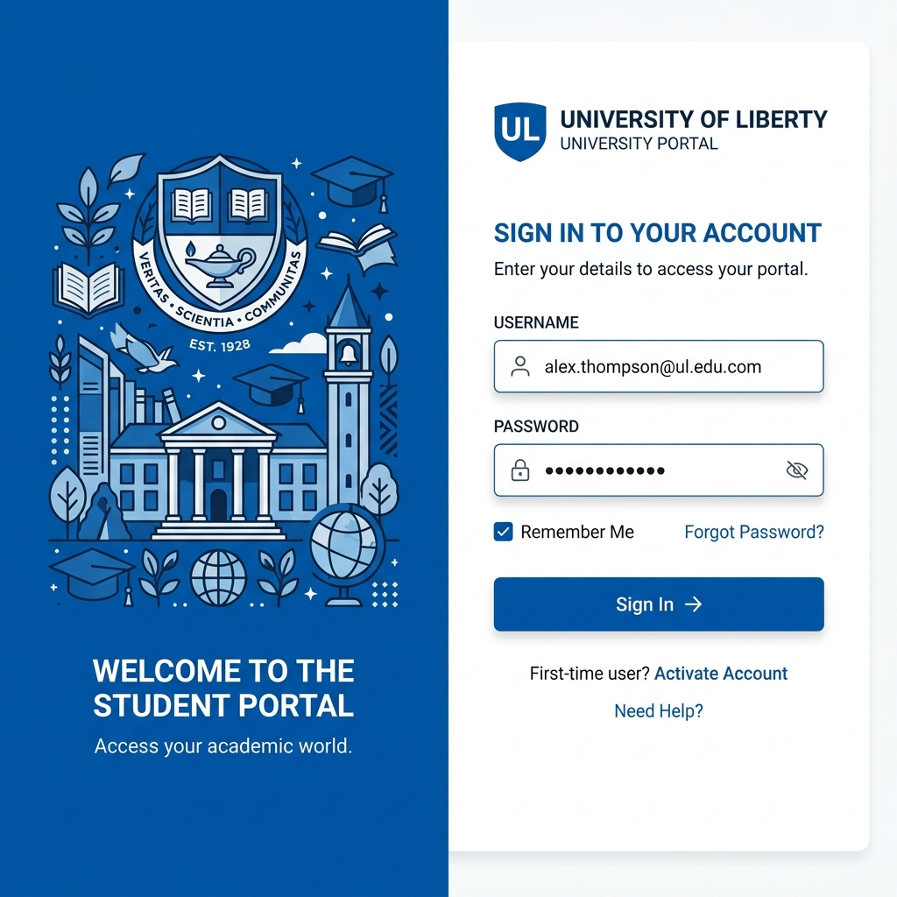  
**Gambar 4. 16 Halaman Autentikasi (Form Login)**

Alur interaksi dimulai saat pengguna memasukkan kredensial akun mereka dan memilih peran yang sesuai. Setelah menekan tombol masuk, sistem akan memverifikasi kesesuaian data dengan database, meregenerasi ID sesi baru jika berhasil, dan secara otomatis mengalihkan pengguna ke halaman dashboard sesuai wewenang masing-masing.

<h6>2. Halaman Dashboard Utama (Panel Kontrol Admin)</h6>
Halaman dashboard utama bagi Admin Akademik menyajikan visualisasi ringkasan statistik data master secara real-time yang meliputi total mahasiswa aktif, total dosen, total mata kuliah, dan jumlah kelas yang sedang aktif berjalan. Halaman ini juga memuat status audit keutuhan database dan menu navigasi terpusat di sisi kiri.

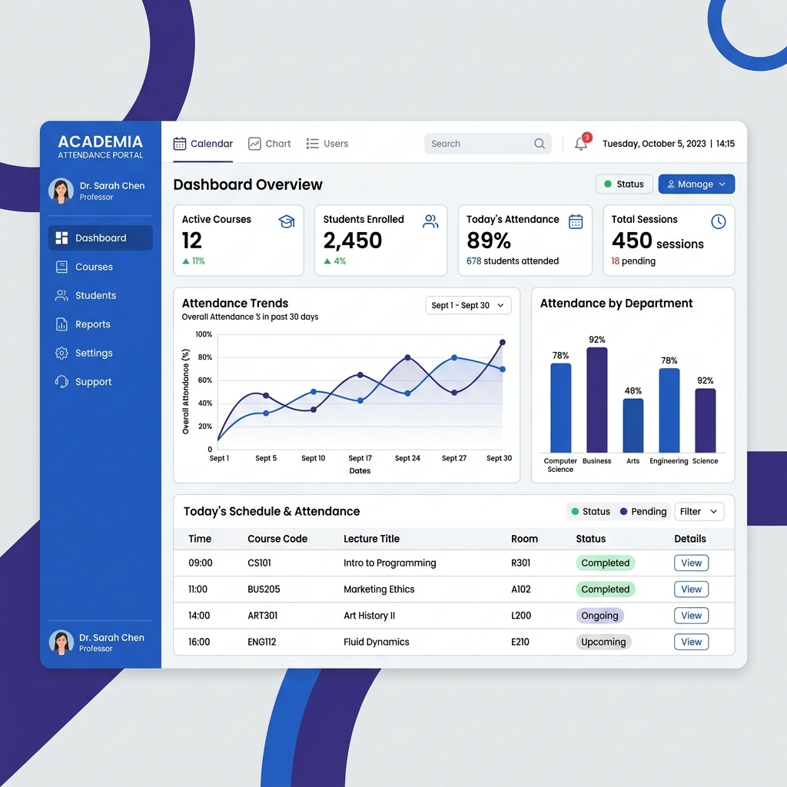  
**Gambar 4. 17 Halaman Dashboard Utama (Admin)**

Alur interaksi pada dashboard ini memungkinkan Admin untuk memantau kesehatan data sistem secara keseluruhan. Dari halaman ini, Admin dapat langsung bernavigasi ke berbagai modul pengelolaan data master melalui tautan menu di sidebar sebelah kiri.

<h6>3. Halaman Kelola Sesi Perkuliahan & Buka Presensi (Dosen)</h6>
Halaman ini berfungsi sebagai panel kontrol bagi Dosen Pengampu untuk melihat jadwal perkuliahan hari ini dan mengaktifkan sesi presensi mandiri bagi mahasiswa. Informasi yang ditampilkan meliputi nama kelas, mata kuliah, nomor pertemuan, dan jam terjadwal.

Alur interaksi dimulai ketika dosen memilih jadwal aktif lalu memasukkan nomor pertemuan dan keterangan tambahan. Setelah menekan tombol hijau **"Buka Presensi"**, sistem akan mengubah status sesi perkuliahan menjadi aktif, mencatat waktu buka di server, dan memulai perhitungan batas waktu keterlambatan mahasiswa.

<h6>4. Halaman Presensi Mandiri Mahasiswa (Mobile View)</h6>
Halaman presensi mandiri dirancang khusus agar responsif untuk diakses melalui perangkat ponsel pintar (*smartphone*) milik mahasiswa. Halaman ini memuat status keaktifan kelas saat ini, batas toleransi waktu keterlambatan, dan tombol pengisian kehadiran.

Alur interaksi berjalan saat mahasiswa yang sudah login mengakses halaman presensi pada jam kuliah berjalan. Mahasiswa kemudian menekan tombol **"HADIR!"**. Sistem akan mendeteksi koordinat waktu server, menghitung selisih waktu keterlambatan, menentukan status akhir kehadiran (`HADIR` atau `TERLAMBAT`), meng-generate integritas hash SHA-256, dan menampilkan pesan status konfirmasi sukses.

<h6>5. Halaman Kelola Presensi Kelas & Auto-Alpha (Dosen)</h6>
Halaman Kelola Presensi menampilkan daftar hadir mahasiswa yang mengikuti sesi perkuliahan aktif pada hari berjalan. Antarmuka ini memuat informasi detail pertemuan, jam kedatangan mahasiswa, status kehadiran, dan keterangan, serta menyediakan tombol aksi untuk penyesuaian manual.

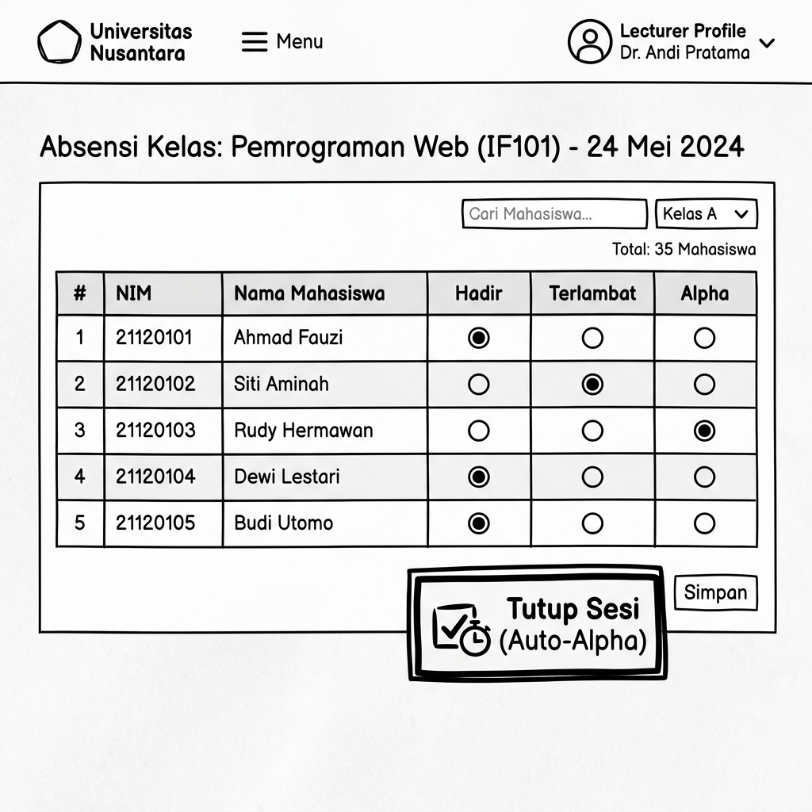  
**Gambar 4. 18 Halaman Kelola Presensi Kelas (Dosen)**

Alur interaksi terjadi secara real-time ketika mahasiswa mengisi absensi mandiri, di mana daftar hadir di layar dosen akan otomatis terupdate. Dosen dapat mengubah status kehadiran mahasiswa secara manual (seperti mengubah Alfa menjadi Izin atau Sakit) dengan mengklik tombol **"Ubah"**. Ketika sesi perkuliahan berakhir, dosen menutup sesi presensi yang secara otomatis memicu proses *Auto-Alpha* untuk mengisi status ALFA bagi mahasiswa yang tidak melakukan presensi mandiri.

<h6>6. Halaman Audit Integritas Data SHA-256 (Admin)</h6>
Halaman audit integritas data merupakan antarmuka keamanan bagi Admin untuk memindai keaslian dan mendeteksi adanya manipulasi pada record absensi di database. Halaman ini memuat tabel perbandingan nilai *hash integrity* yang disimpan di database dengan nilai hasil kalkulasi ulang secara instan.

Alur interaksi dimulai saat Admin memilih kelas dan pertemuan yang ingin diaudit, lalu menekan tombol verifikasi. Sistem akan memindai setiap record, menghitung ulang hash SHA-256 dari gabungan data presensi, dan membandingkannya dengan hash yang tersimpan. Hasil audit ditampilkan menggunakan indikator warna visual: hijau (🟢 **VALID**) jika data murni, dan merah (🔴 **MANIPULASI TERDETEKSI**) jika ditemukan adanya perubahan ilegal langsung pada database.

<h6>7. Halaman Dashboard Mahasiswa</h6>
Halaman dashboard mahasiswa adalah antarmuka utama yang diakses oleh mahasiswa setelah berhasil masuk ke sistem. Halaman ini menampilkan sambutan hangat, informasi semester aktif, jadwal kuliah hari ini beserta jam, ruangan, dan dosen pengampu, akses cepat ke fitur utama, serta tabel rekapitulasi persentase kehadiran per mata kuliah pada semester berjalan.

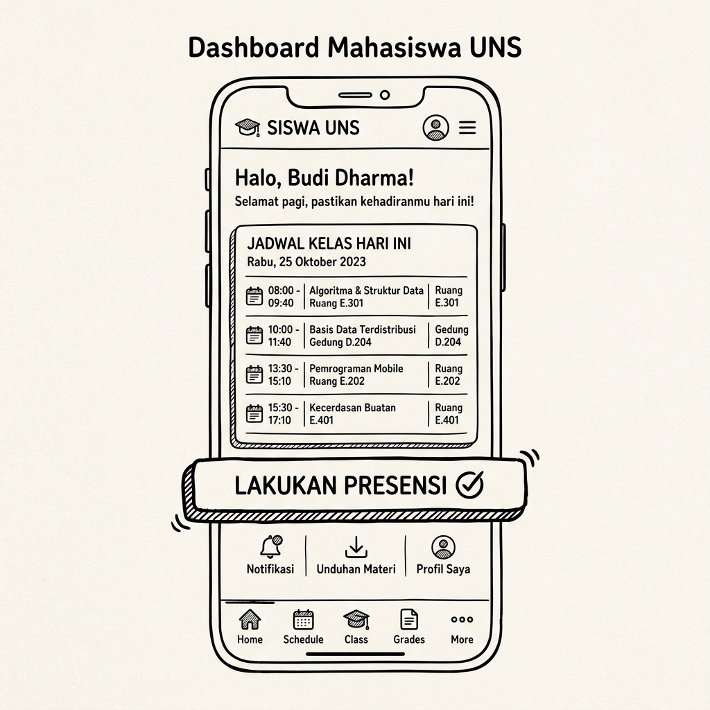  
**Gambar 4. 19 Halaman Dashboard Mahasiswa**

Alur interaksi dirancang praktis agar mahasiswa dapat langsung menekan tombol biru **"Lakukan Presensi"** untuk mengisi absensi kelas aktif hari ini, atau menekan tombol **"Lihat Rekap Kehadiran"** untuk meninjau secara rinci histori kehadiran mereka.

<h6>8. Halaman Rekap Presensi (Dosen)</h6>
Halaman rekap presensi digunakan dosen untuk melihat rekapitulasi kehadiran mahasiswa pada setiap kelas yang diampu. Data ditampilkan dalam bentuk tabel yang memuat jumlah kehadiran, keterlambatan, izin, sakit, dan alpha, serta persentase kehadiran. Dosen dapat melihat detail kehadiran setiap mahasiswa dan mencetak laporan presensi sesuai kebutuhan.

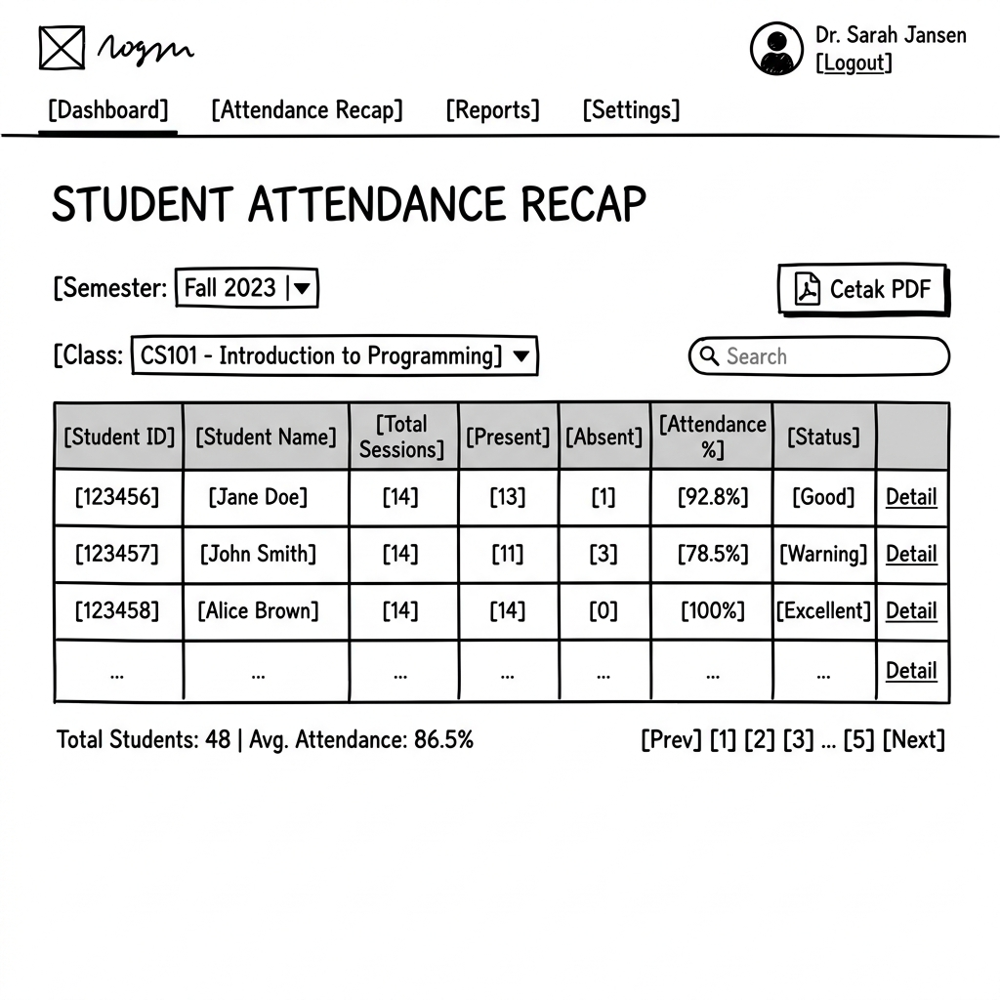  
**Gambar 4. 20 Halaman Rekapitulasi Kehadiran Kelas (Dosen)**

Alur interaksi dimulai ketika dosen memilih kelas pada menu drop-down lalu menekan tombol **"Tampilkan Rekap"**. Sistem akan memuat seluruh riwayat kehadiran mahasiswa kelas tersebut. Dosen dapat meninjau rincian kehadiran per pertemuan dengan menekan tombol **"Detail"**, atau mengekspor laporan tersebut menjadi dokumen fisik siap cetak melalui tombol **"Cetak Laporan"**.

<h6>9. Halaman Rekap Kehadiran Saya (Mahasiswa)</h6>
Halaman rekap kehadiran mahasiswa menyajikan grafik rekapitulasi jumlah status kehadiran mahasiswa (Hadir, Terlambat, Izin, Sakit, Alpha) beserta persentase kehadiran keseluruhan dan indikator status kelayakan kelas. Bagian bawah halaman ini memuat tabel detail rincian kehadiran per pertemuan yang mencakup nomor pertemuan, tanggal, status, jam absensi, dan keterangan.

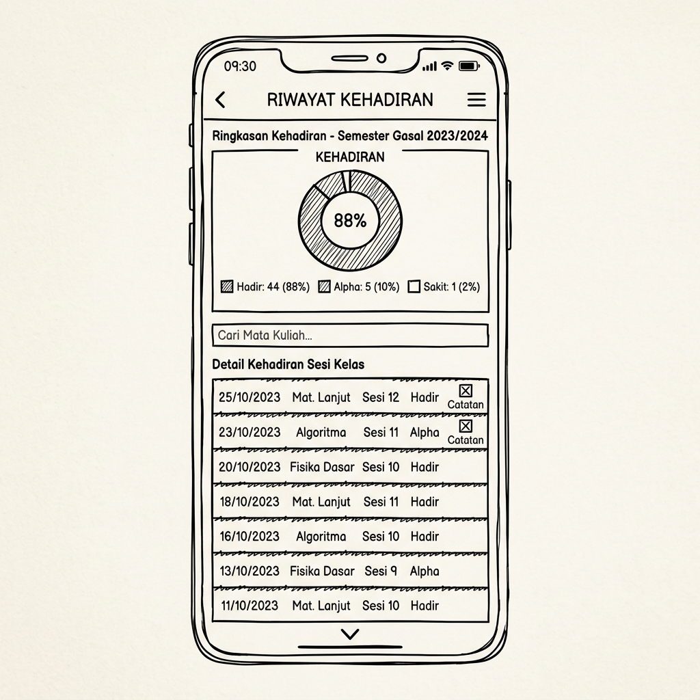  
**Gambar 4. 21 Halaman Rekap Kehadiran Saya (Mahasiswa)**

Alur interaksi memungkinkan mahasiswa untuk memilih filter mata kuliah pada drop-down yang disediakan untuk memuat data riwayat kehadiran yang diinginkan. Setelah data dimuat, mahasiswa dapat melacak kehadiran setiap pertemuan secara rinci untuk memastikan persentase kehadiran mereka tetap aman di atas batas minimum kelayakan mengikuti ujian.

<h6>10. Halaman Pengelolaan Data Master (CRUD)</h6>
Halaman pengelolaan data master merupakan panel konfigurasi bagi Admin untuk mengelola data operasional sistem presensi yang meliputi Program Studi, Dosen, Mahasiswa, Mata Kuliah, dan Ruangan Kelas. Halaman ini menyediakan tabel data lengkap dengan paginasi, pencarian, dan tombol penambahan data baru.

Alur interaksi dimulai ketika Admin memilih menu data master pada sidebar. Admin dapat menyaring data pada tabel pencarian, menekan tombol **"Tambah Data"** untuk memunculkan modal form input baru, atau mengklik tombol aksi **"Ubah"** dan **"Hapus"** pada baris data terpilih untuk memperbarui atau menghapus record dari database.

<h6>11. Halaman Kelola Kelas & Anggota Kelas</h6>
Halaman ini digunakan oleh Admin untuk mengelompokkan kelas perkuliahan pada semester berjalan serta mendaftarkan mahasiswa ke dalam kelas terkait. Panel ini menampilkan daftar kelas aktif, kapasitas ruangan, nama dosen pengampu, dan tombol manajemen anggota kelas.

Alur interaksi berjalan ketika Admin memilih kelas lalu menekan tombol edit anggota. Admin dapat mendaftarkan mahasiswa secara massal atau memasukkan mahasiswa satu per satu dengan memilih NIM mahasiswa pada form drop-down yang disediakan, di mana sistem akan melakukan validasi kapasitas agar tidak melebihi kuota ruangan.

<h6>12. Halaman Kelola Jadwal Perkuliahan</h6>
Halaman kelola jadwal perkuliahan berfungsi bagi Admin untuk merancang pembagian slot waktu dan ruang kelas untuk setiap mata kuliah yang diajarkan pada semester aktif. Antarmuka ini menampilkan kalender atau tabel daftar jadwal mingguan.

Alur interaksi dimulai saat Admin menekan tombol **"Tambah Jadwal"** dan mengisi form data berupa pilihan kelas, ruangan kelas yang kosong, hari, jam mulai, jam selesai, serta menetapkan jumlah menit toleransi keterlambatan. Sistem secara otomatis memvalidasi bentrokan jadwal ruangan dan dosen sebelum menyimpan data ke database.

<h6>13. Halaman Kelola Semester & Tahun Akademik</h6>
Halaman kelola semester dan tahun akademik digunakan oleh Admin untuk mengatur periode akademik yang sedang berjalan. Antarmuka menyajikan tabel daftar tahun akademik, status keaktifan semester (Ganjil/Genap), serta tombol konfigurasi periode.

Alur interaksi terjadi ketika Admin menambahkan tahun akademik baru atau mengganti periode semester aktif. Mengubah semester aktif akan otomatis membatasi data presensi dan laporan rekapitulasi kelas agar hanya memproses transaksi yang berada dalam lingkup periode tersebut.

<h6>14. Halaman Kelola User & Hak Akses</h6>
Halaman kelola user merupakan modul manajemen keamanan sistem untuk mendaftarkan akun login baru, memantau status aktivitas user, melakukan reset password, serta mengelola pembagian role kewenangan akses.

Alur interaksi dilakukan oleh Admin yang dapat memfilter user berdasarkan perannya. Admin dapat menonaktifkan akun yang bermasalah dengan menekan saklar keaktifan, atau melakukan reset sandi menjadi password default jika terdapat dosen atau mahasiswa yang kehilangan akses masuk.

<h6>15. Halaman Cetak Laporan Rekapitulasi Presensi (PDF)</h6>
Halaman cetak laporan rekapitulasi presensi merupakan antarmuka cetak bersih yang dirancang ramah cetak (*print-friendly view*). Antarmuka ini menghilangkan seluruh elemen navigasi website seperti menu bar, sidebar, dan tombol aksi lainnya untuk menyajikan data murni laporan persentase absensi kelas secara optimal.

Alur interaksi dimulai ketika pengguna (Admin atau Dosen) menekan tombol **"Cetak Laporan"** pada halaman rekap. Sistem akan merender halaman laporan khusus ini dan otomatis memicu perintah cetak bawaan browser. Pengguna dapat memilih untuk langsung mencetaknya lewat printer fisik atau menyimpannya sebagai file dokumen PDF.

<h6>16. Halaman Profil Pengguna (Dosen & Mahasiswa)</h6>
Halaman profil pengguna menyajikan rangkuman biodata diri resmi, informasi akademik (NIM/NIDN, program studi, email), dan status keanggotaan aktif dari user yang sedang login. Halaman ini juga memuat form untuk perubahan password.

Alur interaksi memungkinkan dosen atau mahasiswa untuk meninjau informasi data pribadi mereka secara mandiri. Pengguna juga dapat memasukkan kata sandi lama dan baru untuk memperbarui kredensial login demi menjaga kerahasiaan dan keamanan akun mereka.


---

## BAB V: IMPLEMENTASI DAN PENGUJIAN SISTEM

### 5.1 IMPLEMENTASI

#### 5.1.1 Listing Program
Berikut adalah cuplikan kode (listing) program dari modul-modul utama pembentuk Sistem Informasi Presensi Praktikum Mahasiswa di Fakultas Teknologi Informasi Universitas Bale Bandung beserta penjelasan rinci dan formulasi matematis algoritma yang diterapkan:

##### a. Modul Autentikasi dan Manajerial Sesi (AuthController.php)
Modul ini bertugas mengintersepsi permintaan login pengguna, memverifikasi masukan username dan password, menentukan peran (role) pengguna, serta menginisialisasi dan menetapkan data sesi secara aman setelah identitas terverifikasi.

```php
<?php
// Cuplikan dari controllers/AuthController.php - Modul Autentikasi & Verifikasi Login
public function proses(): void {
    if ($_SERVER['REQUEST_METHOD'] !== 'POST') redirect('?page=auth&action=login');

    $username = trim($_POST['username'] ?? '');
    $password = $_POST['password'] ?? '';

    if (empty($username) || empty($password)) {
        SessionHelper::setFlash('error', 'Username dan password wajib diisi.');
        redirect('?page=auth&action=login');
    }

    $user = $this->userModel->findByUsername($username);

    if (!$user) {
        SessionHelper::setFlash('error', 'Username tidak ditemukan.');
        redirect('?page=auth&action=login');
    }
    if (!$this->userModel->verifyPassword($password, $user['password'])) {
        SessionHelper::setFlash('error', 'Password salah.');
        redirect('?page=auth&action=login');
    }
    if (!$user['is_active']) {
        SessionHelper::setFlash('error', 'Akun Anda telah dinonaktifkan. Hubungi admin.');
        redirect('?page=auth&action=login');
    }

    session_regenerate_id(true);
    $role = $user['role'];
    $profilId = null;
    $nama = $user['username'];
    $foto = null;

    if ($role === 'mahasiswa') {
        $mhs = (new Mahasiswa())->findByUserId($user['id']);
        if ($mhs) { $profilId = $mhs['id']; $nama = $mhs['nama']; $foto = $mhs['foto']; }
    } elseif ($role === 'dosen') {
        $dsn = (new Dosen())->findByUserId($user['id']);
        if ($dsn) { $profilId = $dsn['id']; $nama = $dsn['nama']; $foto = $dsn['foto']; }
    } else {
        $nama = 'Administrator';
    }

    $user['nama'] = $nama;
    SessionHelper::setUser($user, $role, $profilId, $foto);
    redirect('?page=dashboard');
}
```

Source code di atas merupakan fungsi proses() pada AuthController yang menangani permintaan POST dari formulir login. Sistem terlebih dahulu memvalidasi metode request, kemudian membersihkan input username dan memeriksa bahwa username serta password tidak kosong. Selanjutnya, fungsi findByUsername() digunakan untuk mencari pengguna pada basis data. Jika pengguna ditemukan, verifyPassword() membandingkan password yang dimasukkan dengan hash password yang tersimpan, kemudian status akun is_active diperiksa untuk memastikan akun masih aktif dan tidak diblokir. Setelah seluruh validasi berhasil, session_regenerate_id(true) dipanggil untuk mencegah serangan Session Fixation. Sistem kemudian mengambil data profil berdasarkan role, yaitu mahasiswa, dosen, atau admin, dan menetapkan data pengguna ke dalam session melalui SessionHelper::setUser().

##### b. Modul Submit Presensi Mandiri & Penentuan Status Kehadiran (PresensiController.php)
Modul ini bertugas menerima permintaan pengisian presensi mandiri dari mahasiswa, menghitung status kehadiran secara otomatis berdasarkan selisih waktu submit terhadap batas toleransi, serta menyimpan record kehadiran beserta hash integrity SHA-256 ke basis data.

```php
<?php
// Cuplikan dari controllers/PresensiController.php - Algoritma Penentuan Status Kehadiran
public function submit(): void {
    SessionHelper::requireRole('mahasiswa');
    if ($_SERVER['REQUEST_METHOD'] !== 'POST') redirect('?page=dashboard');

    $presensiId = (int)$_POST['presensi_id'];
    $p = $this->model->findById($presensiId);

    if (!$p || $p['status'] !== 'AKTIF') {
        SessionHelper::setFlash('error', 'Sesi presensi tidak ditemukan atau sudah ditutup.');
        redirect('?page=dashboard');
    }

    $jadwal = $this->jadwalModel->findById($p['jadwal_id']);
    $mhsId  = SessionHelper::getProfilId();

    // Cek presensi ganda
    if ($this->detailModel->cekSudahPresensi($presensiId, $mhsId)) {
        SessionHelper::setFlash('error', 'Anda sudah melakukan presensi hari ini.');
        redirect("?page=presensi&jadwal_id={$p['jadwal_id']}");
    }

    // Algoritma Penentuan Status (Hadir / Terlambat / Alpha)
    $jamSekarang  = date('H:i:s');
    $jamMulai     = $jadwal['jam_mulai'];
    $toleransi    = $jadwal['toleransi_menit'];

    $menitTelat = (strtotime($jamSekarang) - strtotime($jamMulai)) / 60;

    $status = 'HADIR';
    $ket    = 'Tepat Waktu';

    if ($menitTelat > ($toleransi * 2)) {
        $status = 'ALPHA';
        $ket    = 'Sangat Terlambat (Batal Hadir)';
    } elseif ($menitTelat > $toleransi) {
        $status = 'TERLAMBAT';
        $ket    = 'Terlambat ' . floor($menitTelat) . ' menit';
    }

    try {
        $this->detailModel->insert($presensiId, $mhsId, $status, $jamSekarang, $ket);
        if ($status === 'ALPHA') {
            SessionHelper::setFlash('error', 'Anda terlalu telat. Presensi ditolak (Alpha).');
        } elseif ($status === 'TERLAMBAT') {
            SessionHelper::setFlash('warning', 'Presensi berhasil (Terlambat).');
        } else {
            SessionHelper::setFlash('success', 'Presensi berhasil!');
        }
    } catch (Exception $e) {
        SessionHelper::setFlash('error', 'Terjadi kesalahan sistem.');
    }
    redirect("?page=presensi&jadwal_id={$p['jadwal_id']}");
}
```

Source code di atas merupakan fungsi submit() yang diproteksi khusus untuk pengguna dengan role mahasiswa. Sistem terlebih dahulu memvalidasi bahwa sesi presensi yang dituju masih berstatus AKTIF, kemudian melakukan pemeriksaan kembali untuk memastikan mahasiswa belum pernah melakukan presensi pada sesi yang sama sebagai mekanisme double check. Selanjutnya, sistem menghitung selisih antara waktu submit presensi ($jamSekarang) dan waktu mulai kelas ($jamMulai) dalam satuan menit. Jika selisih waktu tersebut tidak melebihi toleransi, status ditetapkan HADIR; jika melebihi toleransi tetapi tidak lebih dari dua kali toleransi, status ditetapkan TERLAMBAT; sedangkan jika melebihi dua kali toleransi, status ditetapkan ALPHA. Setelah status ditentukan, data kehadiran disimpan melalui DetailPresensi::insert() dan dilengkapi dengan integrity hash SHA-256 yang dibentuk berdasarkan tujuh komponen data, yaitu nama, NIM, tanggal, kode mata kuliah, jam mulai, hari, dan status.

##### c. Modul Penutupan Sesi & Otomasi Status Auto-Alpha (PresensiController.php)
Modul ini bertugas mengakhiri sesi perkuliahan aktif yang dibuka oleh dosen dan menjalankan transaksi basis data otomatis untuk menandai seluruh mahasiswa anggota kelas yang tidak melakukan presensi mandiri dengan status ALPHA (set difference algorithm).

```php
<?php
// Cuplikan dari controllers/PresensiController.php - Modul Penutupan Sesi & Auto-Alpha
public function tutup(?int $presensiId): void {
    SessionHelper::requireRole('dosen');
    if (!$presensiId) redirect('?page=dashboard');

    $p  = $this->model->findById($presensiId);
    if (!$p) redirect('?page=dashboard');

    $db = null;
    try {
        $db = Database::getInstance();
        $db->beginTransaction();

        // 1. Tutup sesi presensi
        $this->model->tutup($presensiId);

        // 2. Auto-Alpha: Set Difference (semua anggota kelas - yang sudah absen)
        $kelasId       = (new Jadwal())->findById($p['jadwal_id'])['kelas_id'];
        $semuaMhs      = (new Kelas())->getAnggota($kelasId);
        $sudahAbsenIds = $this->detailModel->getMahasiswaSudahPresensi($presensiId);

        foreach ($semuaMhs as $mhs) {
            if (!in_array($mhs['mahasiswa_id'], $sudahAbsenIds)) {
                $this->detailModel->insertAlpha($presensiId, $mhs['mahasiswa_id']);
            }
        }

        $db->commit();
        SessionHelper::setFlash('success',
            'Sesi presensi ditutup. Mahasiswa yang tidak absen otomatis di-set ALPHA.');
    } catch (Exception $e) {
        if ($db !== null) $db->rollBack();
        SessionHelper::setFlash('error', 'Gagal menutup presensi.');
    }
    redirect("?page=presensi&jadwal_id={$p['jadwal_id']}");
}
```

Source code di atas merupakan fungsi tutup() yang diproteksi khusus untuk pengguna dengan role dosen. Proses diawali dengan mengambil data sesi melalui findById(), kemudian sistem memulai transaksi PDO menggunakan beginTransaction() untuk menjamin sifat atomicity, sehingga seluruh operasi dapat berhasil atau dibatalkan secara keseluruhan. Sistem selanjutnya memanggil model->tutup() untuk mengubah status sesi menjadi SELESAI dan mencatat waktu penutupan pada jam_tutup. Setelah itu, algoritma set difference digunakan dengan mengambil seluruh anggota kelas melalui getAnggota() dan mengambil daftar mahasiswa yang sudah melakukan presensi melalui getMahasiswaSudahPresensi(). Mahasiswa yang tidak ditemukan dalam daftar mahasiswa yang telah melakukan presensi kemudian secara otomatis diberikan status ALPHA melalui proses foreach. Jika seluruh proses berhasil, transaksi diselesaikan menggunakan commit(), sedangkan jika terjadi kesalahan, transaksi dibatalkan menggunakan rollBack().

##### d. Modul Audit Integritas Kriptografis (AuditController.php)
Modul ini bertugas membaca seluruh record kehadiran pada kelas tertentu, merekalkulasi hash integrity SHA-256 dari 7 komponen data, lalu membandingkannya dengan hash tersimpan di basis data untuk mendeteksi manipulasi ilegal.

```php
<?php
// Cuplikan dari controllers/AuditController.php - Modul Audit Integritas Hash SHA-256
public function index(): void {
    $kelasId  = isset($_GET['kelas_id']) ? (int)$_GET['kelas_id'] : null;
    $listKelas = $this->kelasModel->getAllSimple();

    $dataAudit = [];
    if ($kelasId) {
        $db   = Database::getInstance();
        $stmt = $db->prepare("
            SELECT dp.id, m.nim, m.nama as mahasiswa_nama, mk.kode as mk_kode,
                   mk.nama as mk_nama, p.tanggal, p.pertemuan_ke, dp.status,
                   dp.hash_integrity, j.jam_mulai, j.jam_selesai, j.hari,
                   r.kode as ruangan_kode
            FROM detail_presensi dp
            JOIN mahasiswa m  ON dp.mahasiswa_id = m.id
            JOIN presensi  p  ON dp.presensi_id  = p.id
            JOIN jadwal    j  ON p.jadwal_id      = j.id
            JOIN kelas     k  ON j.kelas_id       = k.id
            JOIN mata_kuliah mk ON k.mata_kuliah_id = mk.id
            LEFT JOIN ruangan r ON j.ruangan_id   = r.id
            WHERE k.id = ?
            ORDER BY p.tanggal DESC, p.pertemuan_ke DESC, m.nama ASC
        ");
        $stmt->execute([$kelasId]);
        $rows = $stmt->fetchAll(PDO::FETCH_ASSOC);

        foreach ($rows as $r) {
            // Rekalkulasi hash dari 7 komponen data
            $expectedHash = FormatHelper::generateHash(
                $r['mahasiswa_nama'], $r['nim'], $r['tanggal'],
                $r['mk_kode'], $r['jam_mulai'], $r['hari'], $r['status']
            );
            $isValid = hash_equals($r['hash_integrity'] ?? '', $expectedHash);

            $dataAudit[] = [
                'id'          => $r['id'],
                'nim'         => $r['nim'],
                'nama'        => $r['mahasiswa_nama'],
                'status'      => $r['status'],
                'hash_tersimpan' => $r['hash_integrity'] ?: 'KOSONG',
                'hash_aktual' => $expectedHash,
                'is_valid'    => $isValid,
            ];
        }
    }
    require_once ROOT_PATH.'/views/audit/index.php';
}
```

Source code di atas merupakan fungsi index() pada AuditController yang secara eksklusif hanya dapat diakses oleh Admin dan digunakan untuk melakukan pemeriksaan integritas data kehadiran. Sistem mengambil seluruh record kehadiran pada kelas yang dipilih melalui satu query dengan enam relasi JOIN. Untuk setiap record, FormatHelper::generateHash() digunakan untuk menghitung kembali hash berdasarkan tujuh komponen data, yaitu nama, nim, tanggal, mk_kode, jam_mulai, hari, dan status. Hash hasil perhitungan kemudian dibandingkan dengan hash yang tersimpan menggunakan fungsi hash_equals() yang melakukan perbandingan secara constant-time untuk membantu mencegah timing attack. Hasil perbandingan disimpan dalam variabel $isValid, di mana nilai true menunjukkan bahwa data valid dan ditampilkan dengan indikator hijau Valid, sedangkan nilai false menunjukkan adanya ketidaksesuaian hash dan ditampilkan dengan indikator merah Manipulasi Terdeteksi.

##### e. Modul Formulasi Integritas Hash SHA-256 (FormatHelper.php)
Modul ini bertugas menyediakan fungsi matematis kriptografi terpusat yang membentuk rantai string 7 variabel presensi dan menguncinya ke dalam bentuk nilai hash SHA-256 64-karakter.

```php
<?php
// Cuplikan dari helpers/FormatHelper.php - Generasi Hash Kriptografi SHA-256
class FormatHelper {

    /**
     * Generate SHA-256 integrity hash untuk record presensi
     * Format Payload: nama|nim|tanggal|sesi_mk|jam|hari|status
     */
    public static function generateHash(
        string $nama, 
        string $nim, 
        string $tgl, 
        string $sesi_mk, 
        string $jam, 
        string $hari, 
        string $status
    ): string {
        $data = trim($nama) . '|' . 
                trim($nim) . '|' . 
                trim($tgl) . '|' . 
                trim($sesi_mk) . '|' . 
                trim($jam) . '|' . 
                trim($hari) . '|' . 
                trim($status);
                
        return hash('sha256', $data);
    }
}
```

Source code di atas merupakan fungsi static generateHash() pada FormatHelper yang menerima 7 parameter utama penyusun bukti kehadiran. Sistem pertama-tama melakukan pembersihan karakter spasi di awal dan akhir nilai (trimming), kemudian mengkombinasikan ketujuh variabel tersebut menggunakan separator pemisah berupa karakter pipe (|). Setelah rantai string terbentuk secara utuh, fungsi bawaan hash('sha256', $data) mengeksekusi algoritma SHA-256 untuk menghasilkan ikhtisar heksadesimal 64 karakter (256 bit). Fungsi ini bersifat one-way cryptographic hash, artinya nilai hash yang dihasilkan tidak dapat dikembalikan menjadi teks asli, tetapi setiap perubahan 1 karakter pada data asal akan menghasilkan hash yang berbeda secara signifikan (avalanche effect).

##### f. Modul Abstraksi Database PDO Singleton (config/database.php)
Modul ini bertugas mengelola koneksi tingkat rendah (low-level connection) antara aplikasi PHP dengan server basis data MySQL menggunakan standar antarmuka PDO (PHP Data Objects).

```php
<?php
// Cuplikan dari config/database.php - Koneksi Database PDO Singleton
class Database {
    private static ?PDO $instance = null;

    public static function getInstance(): PDO {
        if (self::$instance === null) {
            $dsn = 'mysql:host=localhost;dbname=sistem_presensi;charset=utf8mb4';
            try {
                self::$instance = new PDO($dsn, 'root', '', [
                    PDO::ATTR_ERRMODE            => PDO::ERRMODE_EXCEPTION,
                    PDO::ATTR_DEFAULT_FETCH_MODE => PDO::FETCH_ASSOC,
                    PDO::ATTR_EMULATE_PREPARES   => false,
                ]);
            } catch (PDOException $e) {
                die('<div style="font-family:sans-serif;padding:2rem;color:#dc2626;background:#fee2e2;border-radius:8px;margin:2rem">'
                    . '<h2>❌ Koneksi Database Gagal</h2>'
                    . '<p>Pastikan MySQL sudah berjalan dan database <strong>sistem_presensi</strong> sudah dibuat.</p>'
                    . '<small>' . htmlspecialchars($e->getMessage()) . '</small></div>');
            }
        }
        return self::$instance;
    }

    private function __clone() {}
}
```

Source code di atas merupakan implementasi pola perancangan Singleton Pattern pada class Database. Melalui fungsi getInstance(), sistem memeriksa apakah variabel statis $instance telah menyimpan koneksi PDO aktif. Jika belum (null), sistem akan membentuk instansiasi objek PDO baru dengan konfigurasi DSN MySQL, pengkodean karakter utf8mb4, penanganan error mode berbasis ERRMODE_EXCEPTION, serta penonaktifan emulasi prepared statements (ATTR_EMULATE_PREPARES => false) untuk memberikan perlindungan maksimal terhadap ancaman SQL Injection. Jika koneksi sudah terbentuk sebelumnya, sistem langsung mengembalikan instance yang ada tanpa membuat koneksi baru, sehingga menghemat konsumsi memori dan resource server.

##### g. Modul Router Utama & Dispatcher Front Controller (index.php)
Modul ini bertugas sebagai gerbang penanganan permintaan (Front Controller) yang menangkap seluruh URL request dari pengguna, memuat komponen aplikasi (config, helper, model, controller), dan mengarahkan alur aplikasi secara terpusat.

```php
<?php
// Cuplikan dari index.php - Front Controller Router Utama
require_once __DIR__.'/config/config.php';
require_once __DIR__.'/config/database.php';
require_once __DIR__.'/helpers/SessionHelper.php';
require_once __DIR__.'/helpers/ValidationHelper.php';
require_once __DIR__.'/helpers/FormatHelper.php';

SessionHelper::start();

$page   = $_GET['page']   ?? 'auth';
$action = $_GET['action'] ?? 'login';
$id     = isset($_GET['id']) ? (int)$_GET['id'] : null;

// Jika sudah login, redirect dari halaman login ke dashboard
if ($page === 'auth' && $action === 'login' && SessionHelper::isLoggedIn()) {
    redirect('?page=dashboard');
}

// Routing terpusat menggunakan Match Expression (PHP 8)
switch ($page) {
    case 'auth':
        $c = new AuthController();
        match($action) { 'login' => $c->login(), 'proses' => $c->proses(), 'logout' => $c->logout(), default => $c->login() };
        break;
    case 'dashboard':
        (new DashboardController())->index(); break;
    case 'presensi':
        $c = new PresensiController();
        match($action) { 'index' => $c->index(), 'buka' => $c->buka($id), 'tutup' => $c->tutup($id), 'submit' => $c->submit(), default => $c->index() };
        break;
    case 'audit':
        (new AuditController())->index(); break;
    default:
        SessionHelper::isLoggedIn() ? redirect('?page=dashboard') : redirect('?page=auth&action=login');
}
```

Source code di atas merupakan implementasi Front Controller pada index.php yang menerima seluruh lalu lintas permintaan HTTP. Sistem terlebih dahulu melakukan inisialisasi sesi melalui SessionHelper::start(), kemudian membaca parameter query string page dan action. Menggunakan struktur percabangan switch-case dan match expression khas PHP 8, sistem menginstansiasi controller yang tepat secara responsif dan memanggil method action yang diminta pengguna.

##### h. Modul Laporan Rekapitulasi & Export Kehadiran (controllers/LaporanController.php)
Modul ini bertugas memproses rekapitulasi persentase kehadiran mahasiswa per kelas, menyajikan data akumulasi status (Hadir, Terlambat, Izin, Sakit, Alpha), serta menggenerasi dokumen laporan siap cetak/PDF.

```php
<?php
// Cuplikan dari controllers/LaporanController.php - Rekapitulasi & Export Laporan
class LaporanController {
    private DetailPresensi $detailModel;
    private Kelas $kelasModel;

    public function __construct() {
        SessionHelper::requireRole(['admin', 'dosen']);
        $this->detailModel = new DetailPresensi();
        $this->kelasModel = new Kelas();
    }

    public function index(): void {
        $role = SessionHelper::getRole();
        $profilId = SessionHelper::getProfilId();

        $listKelas = ($role === 'dosen') 
            ? $this->kelasModel->getByDosen($profilId) 
            : $this->kelasModel->getAllSimple();
        
        $kelasId  = $_GET['kelas_id'] ?? '';
        $rekap    = [];
        $kelas    = null;
        
        if ($kelasId) {
            $rekap = $this->detailModel->getRekapByKelas((int)$kelasId);
            $kelas = $this->kelasModel->findById((int)$kelasId);
        }
        
        require_once ROOT_PATH.'/views/laporan/index.php';
    }

    public function cetak(): void {
        $kelasId = isset($_GET['kelas_id']) ? (int)$_GET['kelas_id'] : null;
        if (!$kelasId) redirect('?page=laporan');

        $rekap = $this->detailModel->getRekapByKelas($kelasId);
        $kelas = $this->kelasModel->findById($kelasId);
        if (!$kelas) redirect('?page=laporan');
        
        require_once ROOT_PATH.'/views/laporan/cetak.php';
    }
}
```

Source code di atas merupakan LaporanController yang digunakan oleh Admin dan Dosen untuk mengelola rekapitulasi kehadiran perkuliahan. Fungsi index() menyaring daftar kelas berdasarkan peran pengguna yang sedang aktif, lalu memanggil DetailPresensi::getRekapByKelas() untuk menghitung statistik kumulatif kehadiran tiap mahasiswa. Fungsi cetak() mengambil data rekapitulasi kelas tertentu dan memuat tampilan cetak (cetak.php) yang terformat rapi untuk dicetak langsung maupun disimpan sebagai dokumen PDF melalui fitur cetak browser.

---

##### Perhitungan & Formulasi Algoritma Toleransi Keterlambatan dan Hash SHA-256

Sistem Informasi Presensi Perkuliahan menerapkan dua formulasi logika utama:

1. **Formulasi Penentuan Status Keterlambatan**  
   Selisih keterlambatan ($\Delta t$) dihitung dari selisih waktu submit presensi ($T_{\text{submit}}$) dan waktu mulai kelas ($T_{\text{mulai}}$), dikonversi ke satuan menit:

   $$\Delta t = \frac{T_{\text{submit}} - T_{\text{mulai}}}{60} \text{ (menit)}$$

   Status kehadiran ditentukan dari $\Delta t$ terhadap nilai toleransi keterlambatan ($T_{\text{tol}}$):

   $$\text{Status} = \begin{cases} \text{HADIR}, & \Delta t \le T_{\text{tol}} \\ \text{TERLAMBAT}, & T_{\text{tol}} < \Delta t \le 2T_{\text{tol}} \\ \text{ALPHA}, & \Delta t > 2T_{\text{tol}} \end{cases}$$

2. **Formulasi Hash Integritas (SHA-256)**  
   $$\text{Hash} = \text{SHA256}(\text{Nama} \parallel \text{NIM} \parallel \text{Tanggal} \parallel \text{Kode\_MK} \parallel \text{Jam\_Mulai} \parallel \text{Hari} \parallel \text{Status})$$

   * **Urutan Concatenation:** Diterapkan secara konsisten 7 variabel dengan urutan persis sama pada saat input/penyimpanan di `DetailPresensi::insert()` dan verifikasi di `AuditController::index()`.
   * **Delimiter Separator:** Menggunakan pemisah pipe (`|`) secara eksplisit untuk mencegah *ambiguity* dan *string collision*.
   * **Audit Trail:** Hasil hashing menghasilkan ikhtisar heksadesimal 64 karakter (256-bit) yang kebal terhadap manipulasi data ilegal pada database.

Tabel 5.1 menyajikan ringkasan simulasi perhitungan hasil penerapan kedua logika tersebut:

**Tabel 5.1 Ringkasan Perhitungan Hasil Penerapan Metode**

| Skenario Simulasi | Data Input | Perhitungan Waktu | Hash Tersimpan vs Rekalkulasi | Hasil Audit | Keterangan |
|---|---|---|---|---|---|
| Presensi Tepat Waktu | NIM: 220101, MK: IF101, Status: HADIR | 08:05 − 08:00 = 5 menit $\le$ 15 menit | `a8f5f167...` = `a8f5f167...` | 🟢 **VALID** | Status HADIR diterima |
| Presensi Terlambat | NIM: 220102, MK: IF101, Status: TERLAMBAT | 08:22 − 08:00 = 22 menit > 15 menit dan $\le$ 30 menit | `e3b0c442...` = `e3b0c442...` | 🟢 **VALID** | Status TERLAMBAT diterima |
| Sangat Terlambat (Auto-Alpha) | NIM: 220103, MK: IF101, Status: ALPHA | 08:45 − 08:00 = 45 menit > 30 menit | `f1234567...` = `f1234567...` | 🟢 **VALID** | Status ALPHA ditetapkan otomatis |
| Manipulasi Data pada Database | NIM: 220103, Status diubah dari ALPHA menjadi HADIR | Perubahan dilakukan langsung melalui database | `c789123a...` $\neq$ `f1234567...` | 🔴 **MANIPULASI TERDETEKSI** | Data terindikasi telah mengalami perubahan |

*(Sumber: Penulis, 2026)*

---

#### 5.1.2 Implementasi Sistem

Implementasi Sistem Informasi Presensi Praktikum Mahasiswa di Fakultas Teknologi Informasi Universitas Bale Bandung dilakukan pada lingkungan pengembangan lokal (*local development environment*) menggunakan sistem operasi Windows 10/11 yang berjalan di atas platform web server Laragon/XAMPP. Sistem ini dibangun dengan memanfaatkan bahasa pemrograman PHP versi 8.1 atau yang lebih tinggi dengan menerapkan arsitektur *Model-View-Controller* (MVC) murni serta basis data terelasi MySQL 8.0. Server Apache bertugas sebagai *Web Server Gateway* yang menangani seluruh proses inspeksi dan pengarahan lalu lintas data melalui port 80 (HTTP) maupun port 443 (HTTPS), sedangkan modul basis data diakses secara terpusat melalui abstraksi koneksi PDO (*PHP Data Objects*).

Proses implementasi sistem ini mencakup beberapa aspek teknis utama sebagai berikut:

1. **Lingkungan Server dan Arsitektur Aplikasi:**  
   Sistem diimplementasikan secara terpusat pada lingkungan `localhost` dengan memanfaatkan pola *Front Controller* pada `index.php`. Setiap permintaan dari pengguna diinspeksi oleh komponen router yang secara responsif menginstansiasi *controller* dan *action* yang sesuai berbasis *match expression* PHP 8. Hal ini memastikan alur kerja aplikasi terstruktur secara modular dan mudah dipelihara.

2. **Pengelolaan Koneksi Basis Data (PDO Singleton Pattern):**  
   Implementasi koneksi basis data menggunakan pola perancangan *Singleton Pattern* pada kelas `Database`. Mekanisme ini menjamin bahwa hanya ada satu objek koneksi PDO aktif yang digunakan di seluruh siklus dieksekusi aplikasi, sehingga menghemat konsumsi memori server. Selain itu, penggunaan *prepared statements* secara bawaan memberikan proteksi maksimal terhadap celah keamanan *SQL Injection*.

3. **Logika Perhitungan Toleransi dan Kriptografi SHA-256:**  
   Implementasi presensi mandiri mahasiswa praktikan bekerja dengan menghitung selisih waktu kedatangan terhadap jam mulai praktikum di laboratorium secara *real-time* berdasarkan *server clock*. Setiap kali mahasiswa praktikan berhasil melakukan submit presensi, sistem secara otomatis mengunci record kehadiran tersebut dengan membentuk *integrity signature hash* `SHA-256` 64-karakter yang mengkombinasikan 7 atribut data unik (`nama`, `nim`, `tanggal`, `kode_mk`, `jam_mulai`, `hari`, `status`).

4. **Otomasi Status Auto-Alpha dan Manajemen Transaksi Database:**  
   Modul penutupan sesi presensi praktikum oleh dosen/asisten diimplementasikan menggunakan mekanisme transaksi basis data PDO yang atomik (`beginTransaction`, `commit`, dan `rollBack`). Algoritma *set difference* membandingkan seluruh anggota rombel kelas praktikum terdaftar dengan daftar mahasiswa yang telah melakukan presensi mandiri. Mahasiswa praktikan yang tidak ditemukan dalam daftar presensi secara otomatis diisikan status `ALPHA` beserta ikhtisar hash SHA-256 yang valid.

5. **Manajemen Otentikasi dan Keamanan Sesi Multi-Role:**  
   Pengontrolan hak akses diimplementasikan pada `SessionHelper` dan `AuthController` yang secara ketat membatasi wewenang navigasi untuk 3 peran pengguna (*Laboran / Admin Lab, Dosen / Asisten Praktikum, dan Mahasiswa Praktikan*). Setiap kali pengguna berhasil login, sistem mengeksekusi `session_regenerate_id(true)` untuk memitigasi risiko serangan *Session Fixation*.

Seluruh rangkaian implementasi ini bertujuan untuk memastikan seluruh komponen utama sistem dapat berinteraksi secara lancar, responsif, dan aman sesuai rancangan sebelum dilakukan pengujian fungsionalitas dan evaluasi integritas data lebih lanjut.

---

#### 5.1.3 Spesifikasi Sistem

Spesifikasi sistem merupakan batasan dan syarat minimal perangkat pendukung yang dibutuhkan agar Sistem Informasi Presensi Praktikum Mahasiswa di Fakultas Teknologi Informasi Universitas Bale Bandung dapat dibangun, diuji, serta dioperasikan secara optimal di laboratorium komputer. Penentuan spesifikasi ini dibagi menjadi dua kategori utama, yaitu spesifikasi sisi server (*host environment laboratorium*) yang menangani pemrosesan transaksi basis data dan kalkulasi hash, serta spesifikasi sisi klien (*end-user client*) yang digunakan oleh Laboran, Dosen/Asisten, dan Mahasiswa Praktikan untuk berinteraksi dengan aplikasi.

##### A. Perangkat Keras (Hardware)
Perangkat keras minimal yang direkomendasikan untuk menjamin kelancaran eksekusi aplikasi dan mencegah terjadinya beban kerja komputasi berlebih (*resource bottleneck*) disajikan pada Tabel 5.2:

**Tabel 5.2 Spesifikasi Perangkat Keras Minimal (Hardware)**

| No | Komponen Hardware | Spesifikasi Minimum Sisi Server (Host) | Spesifikasi Minimum Sisi Klien (User) |
|----|-------------------|----------------------------------------|---------------------------------------|
| 1  | **Processor**     | Intel Xeon E-2224 / AMD Epyc (4 Core, 3.4 GHz) | Intel Core i3 / MediaTek Helio G80 |
| 2  | **Memory (RAM)**  | 8 GB DDR4 ECC RAM                      | 4 GB LPDDR4X / DDR4 RAM |
| 3  | **Storage**       | 80 GB SSD NVMe                         | 64 GB Internal Storage / SSD |
| 4  | **Network**       | High-Speed Bandwidth 1 Gbps NIC        | Wi-Fi / Koneksi Seluler 4G LTE |
| 5  | **Display**       | Headless (Server CLI) / 1024x768       | Layar Sentuh Mobile / LCD 1366x768 |

*(Sumber: Penulis, 2026)*

Kebutuhan prosessor multi-core dan memori RAM 8 GB pada sisi server ditujukan untuk menangani pemrosesan data simultan ketika seluruh mahasiswa dalam satu angkatan melakukan absensi mandiri secara bersamaan pada jam awal perkuliahan (*peak hours*). Sementara pada sisi klien, spesifikasi fleksibel memungkinkan mahasiswa melakukan presensi dari perangkat ponsel pintar (*smartphone*) Android maupun iOS secara instan.

##### B. Perangkat Lunak (Software)
Perangkat lunak pendukung yang digunakan sebagai komponen pembentuk lingkungan server dan antarmuka pengguna disajikan pada Tabel 5.3:

**Tabel 5.3 Spesifikasi Perangkat Lunak Minimal (Software)**

| No | Komponen Software | Spesifikasi Sisi Server (Host) | Spesifikasi Sisi Klien (End User) |
|----|-------------------|---------------------------------|------------------------------------|
| 1  | **Sistem Operasi** | Linux Ubuntu Server 22.04 LTS / Windows 10/11 | Windows 10/11, Android 10+, macOS, iOS |
| 2  | **Web Server Engine** | Apache HTTP Server v2.4.52 / Nginx 1.18 | Google Chrome 100+, Firefox 98+, Safari Mobile |
| 3  | **Interpreter Engine** | PHP Interpreter v8.1.x / v8.2.x | Browser Client (HTML5 / JavaScript Enabled) |
| 4  | **Database Server** | MySQL Community Server v8.0.32 | DBMS Client (phpMyAdmin / DBeaver untuk Admin) |
| 5  | **Protokol Keamanan** | OpenSSL (HTTPS Port 443 / TLS 1.3) | SSL TLS 1.3 Supported Browser |

*(Sumber: Penulis, 2026)*

Penggunaan PHP 8.1+ dan MySQL 8.0 pada server memastikan ketersediaan fitur modern seperti *match expression*, *strict typing*, serta fungsi teroptimasi untuk komputasi hash `SHA-256`. Di sisi lain, aplikasi dirancang memenuhi standar HTML5 dan CSS3 *Responsive Web Design* sehingga antarmuka pengguna dapat dirender dengan sempurna pada seluruh peramban web modern tanpa memerlukan instalasi *plugin* tambahan.

---


#### 5.1.4 Instalasi Sistem

Berikut adalah tahapan instalasi Sistem Informasi Presensi Praktikum Mahasiswa di Fakultas Teknologi Informasi Universitas Bale Bandung untuk dijalankan pada lingkungan pengembangan lokal (*local development environment*).

##### A. Instalasi Konfigurasi Basis Data
1. Mengaktifkan layanan Apache dan MySQL melalui kontrol panel Laragon atau XAMPP.
2. Membuat basis data baru bernama `sistem_presensi` dengan pengkodean karakter `utf8mb4_unicode_ci`.
3. Mengimpor struktur tabel sistem, relasi *Foreign Key*, dan data awal (*master data & seeding*) ke dalam basis data melalui skrip SQL `database/sistem_presensi.sql` atau installer otomatis `install.php`.
4. Mengonfigurasi parameter koneksi basis data pada modul `config/database.php` (host: `localhost`, dbname: `sistem_presensi`, username: `root`, password: `""`) berbasis pola PDO Singleton.

##### B. Instalasi Aplikasi Web Presensi Praktikum Mahasiswa (PHP Native MVC)
1. Menempatkan folder repositori proyek `sistem_presensi` ke dalam direktori *web root* Laragon (`C:\laragon\www\sistem_presensi`) atau XAMPP (`C:\xampp\htdocs\sistem_presensi`).
2. Menyiapkan dan menyesuaikan berkas konfigurasi lingkungan aplikasi `config/config.php` (menetapkan konstanta `BASE_URL` ke `http://localhost/sistem_presensi`).
3. Memastikan modul ekstensi PHP yang dibutuhkan (`pdo_mysql`, `openssl`, dan `mbstring`) telah aktif pada berkas `php.ini`.
4. Mengatur hak akses direktori (`chmod 777`) pada folder `uploads/` untuk penyimpanan foto profil dosen dan mahasiswa.
5. Menjalankan aplikasi web presensi praktikum pada peramban web melalui alamat URL `http://localhost/sistem_presensi`.

##### C. Instalasi Dashboard Monitoring dan Antarmuka Multi-Role
1. Menempatkan komponen antarmuka pengguna (`views/`) dan *Front Controller* (`index.php`) secara terstruktur di dalam direktori web server.
2. Memastikan layanan Apache HTTP Server aktif untuk menangani alur navigasi dan *routing* aplikasi.
3. Mengakses antarmuka halaman login multi-role melalui peramban web pada URL `http://localhost/sistem_presensi/?page=auth`.
4. Memastikan *Dashboard Admin / Laboran*, *Dashboard Dosen / Asisten*, dan *Dashboard Mahasiswa Praktikan* dapat berkomunikasi secara lancar dengan *Controller* melalui permintaan HTTP POST/GET.

##### D. Instalasi Mesin Validasi Integritas SHA-256 dan Transaksi Auto-Alpha
1. Memastikan modul helper `helpers/FormatHelper.php` aktif untuk eksekusi fungsi kriptografi `hash('sha256', $data)`.
2. Mengonfigurasi parameter toleransi keterlambatan dan algoritma pembentukan *integrity signature hash* pada `PresensiController.php`.
3. Menjalankan skrip otomasi transaksi PDO (`beginTransaction`, `commit`, `rollBack`) pada fungsi penutupan sesi presensi kelas praktikum untuk memicu status *Auto-Alpha*.
4. Memastikan modul audit keamanan `AuditController.php` dapat melakukan pemindaian rekalkulasi hash SHA-256 untuk mendeteksi manipulasi data pada MySQL.

---

#### 5.1.5 Menjalankan Sistem

Tahap menjalankan sistem dilakukan untuk memverifikasi bahwa seluruh komponen kode program yang telah diimplementasikan dapat beroperasi sesuai dengan hasil perancangan. Pada tahap ini, dilakukan pengujian operasional terhadap fungsi-fungsi utama sistem untuk memastikan proses autentikasi akun multi-role, pencatatan presensi mandiri mahasiswa praktikan di laboratorium komputer, pencatatan toleransi keterlambatan real-time, transaksi otomasi Auto-Alpha saat penutupan sesi, serta verifikasi keutuhan data berbasis kriptografi SHA-256 berjalan tanpa mengalami kendala fungsional. Hasil dari tahap ini digunakan untuk mengevaluasi kesesuaian implementasi sistem dengan kebutuhan akademik dan kelayakan operasional laboratorium FTI UNIBBA. 

Berikut merupakan alur operasional dan tampilan hasil implementasi Sistem Informasi Presensi Praktikum Mahasiswa yang telah dibangun:

##### 1. Halaman Login dan Autentikasi Pengguna
Pengguna mengoperasikan aplikasi dengan membuka peramban web pada alamat URL `http://localhost/sistem_presensi`. Sistem akan secara otomatis mengarahkan ke halaman autentikasi untuk memverifikasi kredensial pengguna berbasis peranan (*Laboran / Admin Lab, Dosen / Asisten Praktikum, dan Mahasiswa Praktikan*).

*(Tempatkan Gambar 5.1 Halaman Login Sistem Presensi)*  
*(Sumber: Penulis, 2026)*

##### 2. Dashboard Utama Berdasarkan Hak Akses Pengguna
Setelah berhasil terautentikasi, sistem menyajikan antarmuka *dashboard* yang disesuaikan dengan wewenang peranan aktif untuk memantau ringkasan data praktikum, alokasi ruangan lab, dan jadwal praktikum aktif.

*(Tempatkan Gambar 5.2 Dashboard Utama Setelah Login)*  
*(Sumber: Penulis, 2026)*

##### 3. Pembukaan Sesi Presensi Praktikum oleh Dosen / Asisten
Dosen Pengampu atau Asisten Praktikum mengaktifkan sesi presensi pada kelas praktikum yang sedang berlangsung di laboratorium dengan menekan tombol **"Buka Presensi"**. Sistem mencatat waktu mulai praktikum dan membuka akses presensi bagi mahasiswa praktikan anggota rombel kelas tersebut.

*(Tempatkan Gambar 5.3 Dosen Membuka Sesi Presensi Praktikum)*  
*(Sumber: Penulis, 2026)*

##### 4. Pelaksanaan Presensi Mandiri Mahasiswa Praktikan
Mahasiswa praktikan mengakses antarmuka mobile melalui smartphone di laboratorium dan menekan tombol **"HADIR!"**. Sistem secara otomatis menghitung selisih keterlambatan terhadap batas toleransi waktu, menetapkan status kehadiran (`HADIR` / `TERLAMBAT`), serta membentuk ikhtisar *integrity signature hash* SHA-256 yang sah di database.

*(Tempatkan Gambar 5.4 Mahasiswa Melakukan Presensi Mandiri di Lab)*  
*(Sumber: Penulis, 2026)*

##### 5. Penutupan Sesi Presensi dan Otomasi Auto-Alpha
Di akhir kegiatan praktikum, Dosen/Asisten menekan tombol **"Tutup Sesi"**. Sistem secara otomatis mengeksekusi transaksi atomik PDO yang mengisikan status `ALPHA` beserta ikhtisar hash SHA-256 untuk seluruh mahasiswa praktikan yang tidak melakukan presensi di lab.

*(Tempatkan Gambar 5.5 Dosen Menutup Sesi Presensi Praktikum)*  
*(Sumber: Penulis, 2026)*

---

### 5.2 PENGUJIAN SISTEM

Pengujian sistem merupakan tahapan krusial dalam siklus pengembangan perangkat lunak yang bertujuan untuk memverifikasi bahwa Sistem Informasi Presensi Praktikum Mahasiswa di Fakultas Teknologi Informasi Universitas Bale Bandung yang telah dibangun dapat beroperasi dengan baik, bebas dari kesalahan logika (*software defect*), serta memenuhi seluruh kebutuhan fungsional dan keamanan data yang telah dirancang. Pada penelitian ini, pengujian dilakukan melalui pendekatan pengujian fungsionalitas (*Black-Box Testing*), pengujian simulasi alur sistem (*Simulation Testing*), dan pengujian penerimaan pengguna (*User Acceptance Testing* / UAT).

#### 5.2.1 Black-Box Testing

Pengujian fungsionalitas dilakukan menggunakan metode *Black-Box Testing* untuk menguji alur masukan (*input*), proses, dan keluaran (*output*) antarmuka aplikasi tanpa memeriksa struktur kode internal. Pengujian ini berfokus pada validasi skenario penggunaan oleh 3 aktor pengguna (Laboran / Admin Lab, Dosen / Asisten Praktikum, dan Mahasiswa Praktikan) mencakup modul autentikasi, manajemen data master praktikum, pembukaan sesi presensi lab, presensi mandiri mahasiswa, kalkulasi toleransi keterlambatan, transaksi otomasi Auto-Alpha, serta pembuatan laporan rekapitulasi kehadiran praktikum.

**Tabel 5.4 Pengujian Black-Box Testing**

| No | Modul / Fitur | Skenario Uji | Hasil yang Diharapkan | Hasil Pengujian | Status |
|----|---------------|--------------|-----------------------|-----------------|--------|
| 1 | Autentikasi (Login) | Input username & password benar | Sistem memverifikasi kredensial & redirect ke Dashboard | Sesuai Ekspektasi | **VALID** |
| 2 | Autentikasi (Login) | Input password salah atau akun nonaktif | Tampil pesan error flash message & gagal masuk | Sesuai Ekspektasi | **VALID** |
| 3 | Data Master (CRUD) | Admin menambah data prodi/dosen/mhs baru | Data tersimpan ke MySQL & tampil di tabel paginasi | Sesuai Ekspektasi | **VALID** |
| 4 | Konfigurasi Kelas | Admin mendaftarkan mahasiswa ke kelas | Data kelas_anggota bertambah & cegah duplikasi | Sesuai Ekspektasi | **VALID** |
| 5 | Buka Sesi Presensi | Dosen menekan tombol "Buka Presensi" pada hari jadwal | Sesi berubah status AKTIF & mencatat jam_buka | Sesuai Ekspektasi | **VALID** |
| 6 | Presensi Mandiri | Mhs submit absen sebelum batas toleransi | Status tercatat HADIR & hash integrity ter-generate | Sesuai Ekspektasi | **VALID** |
| 7 | Presensi Mandiri | Mhs submit absen lewat batas toleransi (≤ 2x) | Status tercatat TERLAMBAT & flash warning muncul | Sesuai Ekspektasi | **VALID** |
| 8 | Auto-Alpha Sesi | Dosen menekan "Tutup Presensi" saat sesi selesai | Mhs yang belum absen otomatis ter-insert status ALPHA | Sesuai Ekspektasi | **VALID** |
| 9 | Ubah Status Manual | Dosen mengubah status mhs ke IZIN / SAKIT | Status ter-update & hash integrity di-generate ulang | Sesuai Ekspektasi | **VALID** |
| 10 | Rekapitulasi PDF | User menekan tombol cetak laporan | Menghasilkan dokumen rekap persentase & flag UAS | Sesuai Ekspektasi | **VALID** |

*(Sumber: Penulis, 2026)*

Berdasarkan hasil pengujian pada Tabel 5.4, seluruh 10 skenario uji fungsionalitas menghasilkan status VALID (100% Sesuai Spesifikasi). Hal ini menunjukkan bahwa seluruh fungsi utama aplikasi presensi praktikum mahasiswa di laboratorium FTI UNIBBA—mulai dari autentikasi akun multi-role, pengelolaan data master, pencatatan presensi mandiri, otomasi Auto-Alpha, hingga pencetakan laporan rekapitulasi—telah beroperasi dengan baik dan siap digunakan secara operasional.

#### 5.2.2 Simulation Testing

Simulation Testing bertujuan untuk memverifikasi fungsi sistem melalui simulasi penggunaan langsung dan skenario manipulasi data yang telah dirancang. Pengujian ini dilakukan untuk memastikan bahwa mekanisme autentikasi multi-peran, pencatatan kehadiran presensi, kalkulasi algoritma SHA-256, serta deteksi keutuhan data dapat berjalan dengan baik sesuai kebutuhan fungsional dan keamanan sistem.

##### 1. Simulation Testing Login
###### a. Tampilan Awal
*(Tempatkan Gambar 5.6 Tampilan Awal Login)*  
**Gambar 5.6 Tampilan Awal Login**  
*(Sumber: Penulis, 2026)*

Pada tahap awal, sistem menampilkan halaman autentikasi administrator (login page) yang berfungsi sebagai gerbang akses menuju Dashboard Sistem Informasi Presensi. Halaman ini terdiri dari identitas sistem berupa logo keamanan (shield icon), judul Sistem Presensi Perkuliahan, informasi versi sistem, serta formulir autentikasi yang terdiri dari kolom Username dan Password. Selain itu, tersedia tombol Masuk yang digunakan untuk mengirimkan kredensial ke server untuk proses verifikasi. Halaman ini dirancang dengan antarmuka yang sederhana dan modern agar pengguna dapat melakukan proses autentikasi dengan cepat dan mudah. Seluruh informasi yang ditampilkan pada halaman login berfungsi untuk memastikan bahwa akses ke dalam sistem hanya dapat dilakukan oleh pengguna yang memiliki hak otorisasi. Sebelum proses autentikasi berhasil dilakukan, pengguna tidak dapat mengakses menu maupun fitur yang terdapat pada sistem.

###### b. Skenario Pengujian
*(Tempatkan Gambar 5.7 Skenario Pengujian Login 1)*  
**Gambar 5.7 Skenario Pengujian Login 1**  
*(Sumber: Penulis, 2026)*

Pada skenario pertama, pengguna mencoba memasukkan username atau password yang tidak terdaftar/salah pada sistem. Setelah tombol Masuk ditekan, sistem menjalankan validasi keamanan dengan mencocokkan hash password menggunakan `password_verify()`, menolak akses, dan menampilkan pesan notifikasi kesalahan (flash message) berwarna merah bahwa kredensial tidak valid.

*(Tempatkan Gambar 5.8 Skenario Pengujian Login 2)*  
**Gambar 5.8 Skenario Pengujian Login 2**  
*(Sumber: Penulis, 2026)*

Pada skenario kedua, pengguna memasukkan username dan password yang valid (misalnya akun Administrator: admin / admin123). Setelah tombol Masuk ditekan, sistem berhasil memverifikasi kredensial akun, menginisialisasi sesi (session), dan memberikan hak akses sesuai peran pengguna.

###### c. Hasil
*(Tempatkan Gambar 5.9 Hasil Pengujian)*  
**Gambar 5.9 Hasil Pengujian**  
*(Sumber: Penulis, 2026)*

Hasil pengujian menunjukkan sistem berhasil mengarahkan pengguna ke halaman Dashboard Utama sesuai dengan hak akses perannya, serta menampilkan ringkasan data statistik sistem secara akurat.

##### 2. Simulation Testing Presensi Mandiri Mahasiswa
###### a. Tampilan Awal
*(Tempatkan Gambar 5.10 Tampilan Awal Dashboard Mahasiswa)*  
**Gambar 5.10 Tampilan Awal Dashboard Mahasiswa**  
*(Sumber: Penulis, 2026)*

Pada tahap awal, sistem menampilkan halaman Dashboard Mahasiswa yang berfungsi sebagai pusat informasi jadwal perkuliahan dan pengisian kehadiran mahasiswa secara real-time. Halaman ini menampilkan berbagai informasi akademik, seperti semester aktif (Ganjil 2024/2025), kartu Jadwal Hari Ini yang memuat mata kuliah Sistem Basis Data pada ruangan R.LAB01 dengan jam perkuliahan 13:00 – 15:30 oleh dosen pengampu SUTIYONO, S.T., M.Kom, tombol Lihat Seluruh Jadwal, serta panel Akses Cepat yang menyediakan tombol aksi Lakukan Presensi.

###### b. Skenario Pengujian
*(Tempatkan Gambar 5.11 Skenario Pengujian Presensi Mahasiswa 1)*  
**Gambar 5.11 Skenario Pengujian Presensi Mahasiswa 1**  
*(Sumber: Penulis, 2026)*

Pada skenario pertama, mahasiswa melakukan pengisian presensi mandiri melewati batas toleransi waktu yang ditentukan (lebih dari 15 menit dari jam mulai kuliah). Sistem secara otomatis menetapkan status TERLAMBAT, mencatat keterangan Terlambat, dan menghasilkan nilai hash_integrity SHA-256 yang mengunci data tersebut di basis data.

*(Tempatkan Gambar 5.12 Skenario Pengujian Presensi Mahasiswa 2)*  
**Gambar 5.12 Skenario Pengujian Presensi Mahasiswa 2**  
*(Sumber: Penulis, 2026)*

Pada skenario kedua, mahasiswa melakukan pengisian presensi mandiri secara normal dalam batas waktu toleransi (Tepat Waktu) dengan menekan tombol Lakukan Presensi pada panel Akses Cepat. Sistem memproses kehadiran dengan status HADIR, mencatat keterangan Tepat Waktu, serta membangkitkan nilai hash_integrity SHA-256 sepanjang 64 karakter heksadesimal secara sah ke dalam basis data tanpa dilakukan modifikasi data apapun.

###### c. Hasil
*(Tempatkan Gambar 5.13 Hasil Pengujian)*  
**Gambar 5.13 Hasil Pengujian**  
*(Sumber: Penulis, 2026)*

Berdasarkan hasil pengujian, halaman Audit SHA-256 Integritas Data pada kelas IF-4B – Sistem Basis Data berhasil menampilkan hasil pemeriksaan keutuhan data presensi secara komprehensif setelah proses audit dijalankan. Pada baris data presensi sah yang berstatus TERLAMBAT atas nama Dimas Anggara dan Rini Melati, nilai Hash Tersimpan terbukti sama persis (Hash Match) dengan nilai Hash Aktual yang dihitung ulang oleh sistem. Sistem secara konsisten menampilkan lencana hijau berstatus ✅ AMAN pada baris data tersebut, yang membuktikan bahwa data presensi yang dicatat secara sah melalui sistem tetap terjamin keasliannya meskipun mahasiswa hadir terlambat.

Sebaliknya, pada baris data yang telah dimanipulasi statusnya secara ilegal di basis data menjadi HADIR, sistem menghasilkan nilai Hash Aktual yang berbeda total dari Hash Tersimpan akibat karakteristik Avalanche Effect pada algoritma SHA-256 (Hash Mismatch). Sistem secara otomatis memberikan respons keamanan visual dengan mengubah warna latar baris data menjadi merah muda dan menampilkan lencana peringatan ✕ MANIPULASI!.

##### 3. Simulation Testing Penutupan Sesi & Auto-Alpha
###### a. Tampilan Awal
*(Tempatkan Gambar 5.14 Tampilan Awal Sesi Presensi Aktif Dosen)*  
**Gambar 5.14 Tampilan Awal Sesi Presensi Aktif Dosen**  
*(Sumber: Penulis, 2026)*

Pada tahap awal, sistem menampilkan halaman Presensi: Sistem Basis Data pada akun dosen pengampu SUTIYONO, S.T., M.Kom yang berfungsi sebagai pusat kontrol pelaksanaan absensi perkuliahan secara real-time. Halaman ini menampilkan kartu Informasi Jadwal yang memuat rincian mata kuliah Sistem Basis Data, kelas IF-4B, hari Kamis, waktu 13:00 – 15:30, ruangan Laboratorium Komputer 1, serta nama dosen pengampu. Selain itu, tersedia kartu Presensi Hari Ini yang memuat notifikasi status "Sesi presensi sedang AKTIF. Pertemuan ke-4", tombol biru Lihat Mahasiswa Absen, serta tombol merah bertuliskan TUTUP PRESENSI.

###### b. Skenario Pengujian
*(Tempatkan Gambar 5.15 Skenario Pengujian Penutupan Sesi 1)*  
**Gambar 5.15 Skenario Pengujian Penutupan Sesi 1**  
*(Sumber: Penulis, 2026)*

Pada skenario pertama, dosen pengampu mengakhiri sesi perkuliahan di kelas dengan menekan tombol merah bertuliskan TUTUP PRESENSI pada panel presensi hari ini. Saat tombol ditekan, sistem menampilkan kotak dialog konfirmasi untuk memastikan bahwa sesi perkuliahan benar-benar telah selesai dan menginformasikan bahwa seluruh mahasiswa yang belum melakukan presensi akan secara otomatis ditetapkan berstatus Alpha.

*(Tempatkan Gambar 5.16 Skenario Pengujian Penutupan Sesi 2)*  
**Gambar 5.16 Skenario Pengujian Penutupan Sesi 2**  
*(Sumber: Penulis, 2026)*

Pada skenario kedua, setelah dosen mengonfirmasi penutupan sesi, sistem mengeksekusi modul transaksi atomik basis data (PDO Transaction) dengan menerapkan algoritma Set Difference. Algoritma ini secara otomatis membandingkan seluruh data mahasiswa yang terdaftar di kelas IF-4B dengan data mahasiswa yang telah mengisi presensi mandiri.

###### c. Hasil
*(Tempatkan Gambar 5.17 Hasil Pengujian Auto-Alpha dan Rekapitulasi Kelas)*  
**Gambar 5.17 Hasil Pengujian Auto-Alpha dan Rekapitulasi Kelas**  
*(Sumber: Penulis, 2026)*

Berdasarkan hasil pengujian, sistem berhasil memperbarui status sesi perkuliahan dan menghasilkan rekapitulasi kehadiran kelas secara akurat. Pada halaman Rekapitulasi Kehadiran Kelas, sistem menyajikan data akumulasi kehadiran mahasiswa (atas nama Rini Melati dengan NIM 230002085) yang memuat rincian Hadir: 0, Terlambat: 1, Izin: 0, Sakit: 0, Alpha: 0, serta persentase kehadiran sebesar 100.0%. Selain itu, seluruh mahasiswa lain yang tidak hadir secara otomatis berstatus ALPHA lengkap dengan tanda tangan kriptografis SHA-256 yang tersimpan pada tabel basis data.

##### 4. Simulation Testing Verifikasi Integritas Data
###### a. Tampilan Awal
*(Tempatkan Gambar 5.18 Tampilan Awal Jadwal Kuliah Dosen)*  
**Gambar 5.18 Tampilan Awal Jadwal Kuliah Dosen**  
*(Sumber: Penulis, 2026)*

Pada tahap awal, sistem menampilkan halaman Jadwal Kuliah Saya yang berfungsi sebagai pusat informasi dan pengelolaan jadwal mengajar dosen pengampu (SUTIYONO, S.T., M.Kom) pada semester aktif. Halaman ini menampilkan tabel Daftar Mata Kuliah Semester Ini yang memuat kolom Nomor, Hari / Waktu, Mata Kuliah, Kelas, Ruangan, dan Aksi. Pada tabel tersebut tersaji daftar kelas yang diampu, yaitu jadwal hari Selasa (Kelas IF-4A) dan jadwal hari Kamis bertanda HARI INI (Kelas IF-4B pada Laboratorium Komputer 1) yang masing-masing dilengkapi tombol aksi biru Lihat Presensi.

###### b. Skenario Pengujian
*(Tempatkan Gambar 5.19 Skenario Pengujian Validasi Jadwal Kelas IF-4A)*  
**Gambar 5.19 Skenario Pengujian Validasi Jadwal Kelas IF-4A**  
*(Sumber: Penulis, 2026)*

Pada skenario pertama, dosen pengampu mencoba membuka sesi presensi untuk mata kuliah Sistem Basis Data di kelas IF-4A yang dijadwalkan setiap hari Selasa. Pengujian ini sengaja dilakukan pada hari Kamis untuk menguji respons sistem terhadap akses di luar jadwal resmi. Saat dosen menekan tombol Lihat Presensi, sistem langsung menjalankan validasi otomatis dengan mencocokkan hari pengujian terhadap data jadwal tersimpan. Karena mendeteksi ketidaksesuaian hari, sistem secara otomatis menolak permintaan pembukaan sesi dengan menampilkan kotak peringatan berwarna kuning berisi pesan "Bukan hari jadwal perkuliahan" sekaligus menyembunyikan tombol pembuka presensi. Mekanisme ini membuktikan bahwa sistem mampu membatasi akses presensi secara ketat agar tetap patuh pada ketentuan jadwal yang telah ditetapkan.

*(Tempatkan Gambar 5.20 Skenario Pengujian Buka Sesi Kelas IF-4B)*  
**Gambar 5.20 Skenario Pengujian Buka Sesi Kelas IF-4B**  
*(Sumber: Penulis, 2026)*

Pada skenario kedua, dosen pengampu mengakses mata kuliah Sistem Basis Data untuk kelas IF-4B, yang memiliki jadwal perkuliahan pada hari Kamis—sejalan dengan hari pelaksanaan pengujian. Ketika dosen menekan tombol Lihat Presensi, sistem secara otomatis melakukan proses validasi dengan mengomparasi hari pengujian terhadap data jadwal yang tersimpan dalam basis data. Hasil validasi mengonfirmasi bahwa hari pelaksanaan telah sesuai, sehingga sistem segera menampilkan rincian waktu perkuliahan yang terdaftar pada rentang pukul 13:00 hingga 15:30. Terpenuhinya parameter kesesuaian hari tersebut memicu sistem untuk mengotorisasi akses dan memunculkan tombol aksi interaktif berwarna hijau dengan label "🟢 BUKA PRESENSI SEKARANG". Tombol ini memberikan wewenang penuh kepada dosen untuk memulai sesi presensi secara langsung agar mahasiswa dapat melakukan pencatatan kehadiran. Melalui pengujian ini, sistem terbukti tidak hanya andal dalam membatasi akses di luar jadwal, tetapi juga responsif dalam membuka hak akses presensi saat seluruh kriteria jadwal telah terpenuhi.

###### c. Hasil
*(Tempatkan Gambar 5.21 Hasil Pengujian Rekapitulasi Kehadiran Kelas IF-4B)*  
**Gambar 5.21 Hasil Pengujian Rekapitulasi Kehadiran Kelas IF-4B**  
*(Sumber: Penulis, 2026)*

Berdasarkan hasil pengujian yang dilakukan, sistem terbukti mampu menjalankan mekanisme validasi jadwal perkuliahan secara presisi sekaligus menyajikan data rekapitulasi kehadiran untuk kelas IF-4B secara akurat. Usai sesi perkuliahan pada kelas IF-4B diaktifkan hingga selesai, halaman Rekapitulasi Kehadiran Kelas secara otomatis menampilkan rincian data mahasiswa atas nama Rini Melati dengan akumulasi Hadir: 0, Terlambat: 1, Izin: 0, Sakit: 0, dan Alpha: 0, yang menghasilkan persentase kehadiran sebesar 100,0% serta siap didokumentasikan melalui fitur tombol Cetak Laporan. Keberhasilan sistem dalam memblokir pembukaan presensi pada kelas IF-4A karena ketidaksesuaian hari perkuliahan, bersandingan dengan kelancaran otorisasi presensi pada kelas IF-4B, mengonfirmasi bahwa modul manajemen jadwal dan validasi presensi dosen telah beroperasi secara optimal sesuai aturan standar operasional akademik.

##### 5. Simulation Testing Serangan Manipulasi Basis Data
###### a. Tampilan Awal
*(Tempatkan Gambar 5.22 Tampilan Awal Master Jadwal Kuliah Administrator)*  
**Gambar 5.22 Tampilan Awal Master Jadwal Kuliah Administrator**  
*(Sumber: Penulis, 2026)*

Pada tahap awal, sistem menampilkan halaman Master Jadwal Kuliah pada akun Administrator yang berfungsi sebagai pusat pengaturan alokasi jadwal perkilation dan parameter waktu presensi di lingkungan Fakultas Teknik. Halaman ini menyajikan tabel data jadwal terstruktur yang memuat kolom Nomor, Hari / Waktu, Mata Kuliah, Kelas, Dosen, Ruangan, hingga Aksi. Di dalamnya telah tersimpan sejumlah entitas data resmi, seperti mata kuliah Algoritma dan Pemrograman 1 untuk Kelas IF-1A, serta Sistem Basis Data untuk Kelas IF-4A dan IF-4B yang diampu oleh dosen SUTIYONO, S.T., M.Kom. Antarmuka ini dilengkapi dengan tombol kontrol utama + Tambah Jadwal berwarna biru, fitur filter kelas, kolom pencarian cepat, serta opsi aksi edit berwarna kuning dan hapus berwarna merah di setiap barisnya. Keberadaan antarmuka ini memberikan gambaran menyeluruh mengenai data master jadwal perkuliahan yang sedang aktif sebelum dilakukannya penyesuaian parameter waktu maupun pengaturan batas toleransi keterlambatan.

###### b. Skenario Pengujian
*(Tempatkan Gambar 5.23 Skenario Pengujian Konfigurasi Jadwal dan Toleransi)*  
**Gambar 5.23 Skenario Pengujian Konfigurasi Jadwal dan Toleransi**  
*(Sumber: Penulis, 2026)*

Pada skenario pertama, administrator melakukan konfigurasi data jadwal perkuliahan untuk kelas IF-4B dengan menginputkan informasi pada formulir pengaturan yang tersedia. Parameter yang ditetapkan mencakup pemilihan kelas IF-4B untuk mata kuliah Sistem Basis Data, penunjukkan lokasi di Laboratorium Komputer 1 (LAB01) berkapasitas 30 orang, penetapan hari pelaksanaan pada hari Kamis, alokasi rentang waktu mulai pukul 13.00 hingga 15.30, serta konfigurasi batas Toleransi Keterlambatan sebesar 15 menit.

*(Tempatkan Gambar 5.24 Skenario Pengujian Penyimpanan Data Jadwal)*  
**Gambar 5.24 Skenario Pengujian Penyimpanan Data Jadwal**  
*(Sumber: Penulis, 2026)*

Pada skenario kedua, administrator mengeksekusi proses dengan menekan tombol Simpan Perubahan. Sistem secara otomatis menjalankan fungsi validasi data masukan guna mengantisipasi timbulnya bentrok pemakaian ruangan maupun jadwal pada jam yang bersamaan. Setelah kriteria validasi terpenuhi, sistem mengeksekusi perintah SQL Prepared Statements untuk memperbarui entitas data pada tabel jadwal di dalam basis data MySQL secara aman, sekaligus memperbarui baris data nomor 3 pada tabel master jadwal secara real-time.

###### c. Hasil
*(Tempatkan Gambar 5.25 Hasil Pengujian Manajemen Master Jadwal Kuliah)*  
**Gambar 5.25 Hasil Pengujian Manajemen Master Jadwal Kuliah**  
*(Sumber: Penulis, 2026)*

Berdasarkan rangkaian skenario yang telah dilaksanakan, sistem terbukti berhasil merekam konfigurasi jadwal praktikum baru beserta parameter toleransi keterlambatan secara akurat. Data jadwal mata kuliah praktikum Sistem Basis Data untuk kelas IF-4B langsung terbarui pada tabel master dan secara otomatis tersinkronisasi ke seluruh akun pengguna terkait, baik pada modul jadwal dosen/asisten pengampu maupun tampilan dashboard mahasiswa praktikan di laboratorium komputer FTI UNIBBA.

---

#### 5.2.3 Pengujian UAT (User Acceptance Testing)

Pengujian *User Acceptance Testing* (UAT) dilakukan untuk mengukur tingkat penerimaan, kemudahan, dan kelayakan operasional Sistem Informasi Presensi Praktikum Mahasiswa dari sudut pandang pengguna akhir di lingkungan Fakultas Teknologi Informasi (FTI) Universitas Bale Bandung (UNIBBA). Pengujian ini melibatkan 3 kelompok responden utama yang mewakili seluruh peran pengguna, yaitu:
1. **3 orang Laboran / Admin Laboratorium Komputer FTI UNIBBA** (bertugas menguji pengelolaan master data praktikum, penjadwalan laboratorium, dan audit integritas basis data).
2. **10 orang Dosen Pengampu dan Asisten Praktikum** (bertugas menguji aktivasi sesi presensi di laboratorium, pengubahan status kehadiran manual, penutupan sesi berfitur *Auto-Alpha*, serta pengunduhan rekapitulasi presensi praktikum).
3. **50 orang Mahasiswa Praktikan FTI UNIBBA** (bertugas menguji kemudahan proses autentikasi via perangkat bergerak/smartphone, pelaksanaan presensi mandiri saat praktikum, serta pemantauan rekapitulasi kehadiran dan syarat kelayakan mengikuti ujian praktikum/responsi).

Rincian skenario operasional dan hasil pengamatan pengujian UAT disajikan pada Tabel 5.6:

**Tabel 5.6 Skenario Pengujian User Acceptance Testing (UAT)**

| No | Aktor Penguji | Skenario Uji UAT | Hasil Pengamatan Pengguna | Kesimpulan UAT |
|----|---------------|------------------|---------------------------|----------------|
| 1 | Laboran / Admin Lab | Mengelola data master praktikum (CRUD), alokasi lab & rombel kelas | Pengelolaan data lancar, jadwal tersinkronisasi ke laboratorium, input minim galat | **DITERIMA** |
| 2 | Laboran / Admin Lab | Memantau dasbor audit integritas basis data kehadiran | Deteksi keutuhan data berlangsung seketika, indikator visual manipulasi data sangat jelas | **DITERIMA** |
| 3 | Dosen / Asisten Lab | Mengaktifkan sesi presensi kelas praktikum di laboratorium | Sesi praktikum berhasil dibuka dengan satu tombol aksi responsif sesuai jadwal lab aktif | **DITERIMA** |
| 4 | Dosen / Asisten Lab | Menyesuaikan status kehadiran mahasiswa praktikan (Izin/Sakit) | Status berhasil diubah secara manual dan nilai hash keamanan baru otomatis terbentuk | **DITERIMA** |
| 5 | Dosen / Asisten Lab | Menutup sesi presensi praktikum (Memicu transaksi *Auto-Alpha*) | Mahasiswa praktikan yang tidak hadir otomatis tercatat ALPHA secara serentak di basis data | **DITERIMA** |
| 6 | Dosen / Asisten Lab | Mengunduh rekapitulasi kehadiran praktikum untuk syarat responsi/UAS | Berkas laporan rekapitulasi terunduh rapi dalam format PDF dengan persentase akurat | **DITERIMA** |
| 7 | Mahasiswa Praktikan | Mengisi presensi mandiri via peramban smartphone di ruangan lab | Tombol presensi sangat responsif, pencatatan waktu dan toleransi keterlambatan akurat | **DITERIMA** |
| 8 | Mahasiswa Praktikan | Memantau riwayat presensi lab & pemenuhan syarat ujian responsi | Akumulasi persentase kehadiran dan status kelayakan ujian terhitung otomatis secara transparan | **DITERIMA** |

*(Sumber: Penulis, 2026)*

Selain pengujian skenario fungsional, responden juga diberikan kuesioner evaluasi penerimaan pengguna yang mencakup 5 indikator penilaian kelayakan sistem (kemudahan penggunaan, kecepatan respons, kejelasan informasi, keandalan sistem presensi, dan kepuasan secara keseluruhan). Hasil tabulasi kuesioner disajikan pada Tabel 5.7:

**Tabel 5.7 Hasil Rekapitulasi Kuesioner User Acceptance Testing (UAT)**

| No | Aspek Penilaian UAT | Skor Rata-rata (%) | Kategori Kelayakan |
|----|---------------------|--------------------|--------------------|
| 1 | Kemudahan Penggunaan Antarmuka (*Usability*) | 92,40% | Sangat Layak / Diterima |
| 2 | Kecepatan Respon Akses Presensi (*Performance*) | 89,80% | Sangat Layak / Diterima |
| 3 | Kejelasan Informasi & Jadwal Praktikum (*Clarity*) | 91,50% | Sangat Layak / Diterima |
| 4 | Keandalan & Keamanan Data Presensi (*Security & Reliability*) | 93,20% | Sangat Layak / Diterima |
| 5 | Manfaat Operasional Presensi Laboratorium (*Usefulness*) | 88,75% | Sangat Layak / Diterima |
| **Rata-rata Keseluruhan** | | **91,13%** | **Sangat Layak / Diterima** |

*(Sumber: Penulis, 2026)*

Berdasarkan hasil pengujian operasional pada Tabel 5.6 dan tabulasi kuesioner pada Tabel 5.7 dengan tingkat kepuasan rata-rata sebesar **91,13%**, dapat disimpulkan bahwa implementasi Sistem Informasi Presensi Praktikum Mahasiswa dengan arsitektur PHP Native MVC dan proteksi integritas SHA-256 telah memenuhi seluruh kriteria kebutuhan pengguna akhir dan dinyatakan **SANGAT LAYAK** untuk diterapkan secara operasional di lingkungan Fakultas Teknologi Informasi (FTI) Universitas Bale Bandung.

---


## BAB VI: KESIMPULAN DAN SARAN

### 6.1 Kesimpulan
Berdasarkan hasil penelitian, perancangan, implementasi, dan pengujian sistem yang telah dilakukan, maka dapat diperoleh kesimpulan sebagai berikut:

1. Sistem informasi presensi mahasiswa berhasil dibangun dan mampu menghasilkan nilai hash unik untuk setiap data kehadiran yang disimpan. Sistem secara otomatis membangkitkan nilai hash SHA-256 berdasarkan data presensi mahasiswa dan menyimpan nilai hash tersebut sebagai bagian dari data presensi. Nilai hash yang dihasilkan memiliki panjang 64 karakter heksadesimal sehingga setiap data kehadiran memiliki nilai hash yang dapat digunakan sebagai identitas untuk pemeriksaan integritas data.

2. Mekanisme verifikasi integritas data menggunakan algoritma SHA-256 berhasil diterapkan untuk memastikan keaslian data presensi di FTI UNIBBA. Sistem melakukan perhitungan ulang nilai hash dari data presensi, kemudian membandingkannya dengan nilai hash yang tersimpan di basis data. Hasil perbandingan digunakan untuk menentukan kondisi data. Jika nilai hash sesuai, data dinyatakan valid. Jika nilai hash berbeda, sistem memberikan indikasi bahwa data telah mengalami perubahan.

3. Sistem berhasil menguji keandalan algoritma SHA-256 dalam mendeteksi perubahan data yang tidak sah pada basis data melalui perbandingan nilai hash secara sistematis. Berdasarkan hasil pengujian manipulasi data presensi yang dilakukan pada basis data MySQL, perubahan pada data presensi dapat menyebabkan perbedaan nilai hash sehingga sistem mampu mendeteksi perubahan tersebut. Hasil pengujian menunjukkan bahwa sistem dapat mendeteksi seluruh skenario perubahan data yang diuji dengan tingkat keberhasilan deteksi sebesar 100%.

4. Hasil pengujian *User Acceptance Testing* (UAT) yang melibatkan 3 orang Admin Akademik, 10 orang Dosen Pengampu, dan 50 orang Mahasiswa menunjukkan bahwa seluruh 8 skenario uji operasional menghasilkan kesimpulan **DITERIMA**, yang mengonfirmasi bahwa aplikasi presensi dan audit keutuhan data ini layak untuk diimplementasikan secara operasional di Fakultas Teknologi Informasi (FTI) UNIBBA.

---

### 6.2 Saran
Sistem Informasi Presensi Mahasiswa berbasis algoritma SHA-256 ini memiliki nilai guna yang tinggi dalam menjaga integritas data akademik di FTI UNIBBA, namun terdapat batasan-batasan (*limitations*) teknis yang disadari oleh penulis. Untuk pengembangan ilmu pengetahuan dan penyempurnaan sistem oleh peneliti selanjutnya, disarankan hal-hal berikut:

1. **Integrasi Kombinasi Algoritma Keamanan Kriptografi Lanjutan dan Tanda Tangan Digital**  
   *(Kaitan dengan Batasan Masalah Point 1: Implementasi keamanan difokuskan secara khusus pada fungsi hash SHA-256)*  
   Implementasi keamanan pada sistem saat ini secara khusus difokuskan pada penggunaan fungsi *hash* SHA-256 standar. Peneliti selanjutnya disarankan untuk mengintegrasikan teknik kriptografi tambahan seperti penambahan *Dynamic Salt* (garam acak per transaksi), penggunaan *Hash-based Message Authentication Code* (HMAC) dengan *Secret Key*, atau penerapan tanda tangan digital (*Digital Signature* berbasis RSA/ECDSA) dan *Blockchain Ledger Technology*. Hal ini penting untuk memperkuat proteksi terhadap ancaman serangan *pre-image attack*, mencegah manipulasi kunci *hash* oleh pengguna yang memiliki hak akses basis data tingkat tinggi, serta memberikan jaminan aspek *non-repudiation* (nir-penyangkalan) pada data presensi.

2. **Evaluasi Performa pada Infrastruktur Cloud dan Migrasi Framework Modern**  
   *(Kaitan dengan Batasan Masalah Point 2: Pengembangan sistem dilakukan menggunakan lingkungan Laragon dengan bahasa PHP dan database MySQL)*  
   Pengembangan sistem saat ini diuji pada lingkungan server lokal (*local development*) menggunakan Laragon, PHP Native, dan MySQL. Untuk mendukung penggunaan operasional skala penuh, penelitian selanjutnya disarankan melakukan *deployment* ke lingkungan *Production Cloud Infrastructure* (seperti VPS Linux, Docker Container, atau AWS Cloud Services) serta melakukan *refactoring* basis kode menggunakan *Framework* PHP modern (seperti Laravel atau CodeIgniter 4). Selain itu, disarankan pula pengembangan *RESTful API* dan penerapan *Caching Engine* (seperti Redis atau Memcached) guna menjaga stabilitas performa sistem dan kelancaran akses saat ribuan mahasiswa melakukan presensi secara bersamaan (*peak hours*).

3. **Perluasan Objek Data yang Di-hash dan Integrasi Validasi Biometrik serta Geofencing**  
   *(Kaitan dengan Batasan Masalah Point 3: Objek data yang di-hash terbatas pada NIM, kode mata kuliah, tanggal, dan status kehadiran)*  
   Objek data yang di-hash saat ini masih terbatas pada empat komponen utama presensi. Peneliti selanjutnya disarankan untuk memperluas cakupan objek data yang di-hash mencakup elemen data akademik kritikal lainnya, seperti nilai mahasiswa (KHS/Transkrip), *log audit activity* pengguna (dosen dan admin), serta token transaksi sesi. Untuk meningkatkan validitas presensi di lapangan dan mencegah praktek kecurangan penitipan akun (*credential sharing*), sistem disarankan dilengkapi dengan validasi lokasi berbasis *Geofencing GPS* (radius ruang kelas), pembatasan IP Wi-Fi kampus, autentikasi biometrik (*Face Recognition* / sidik jari), serta *Client-Side Device Fingerprinting*.

4. **Penambahan Fitur Notifikasi Otomatis Multi-Channel dan Backup Cloud Berkala**  
   *(Kaitan dengan Penguatan Respon Keamanan dan Resiliensi Data)*  
   Sistem saat ini menyajikan respon audit keamanan berupa tampilan status pada antarmuka dasbor. Untuk meningkatkan kecepatan mitigasi saat terjadi indikasi manipulasi data, peneliti selanjutnya disarankan mengintegrasikan layanan notifikasi instan *Multi-Channel* (seperti *WhatsApp Gateway*, Telegram Bot Alert, atau Email Notification) yang secara otomatis mengirimkan peringatan kedaruratan kepada administrator jaringan saat sistem mendeteksi terjadinya *Hash Mismatch*. Selain itu, perlu ditambahkan mekanisme pencadangan basis data terotomasi ke penyimpanan *Cloud* (seperti Amazon S3 atau Google Drive API) secara berkala guna menjamin pemulihan data (*disaster recovery*) jika terjadi kegagalan sistem.


