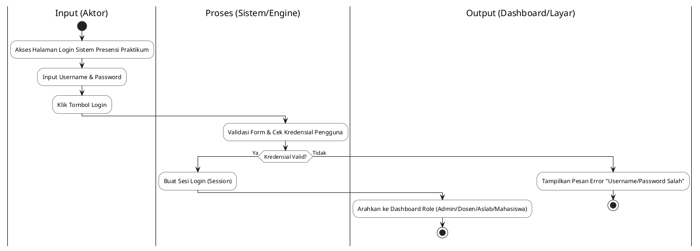
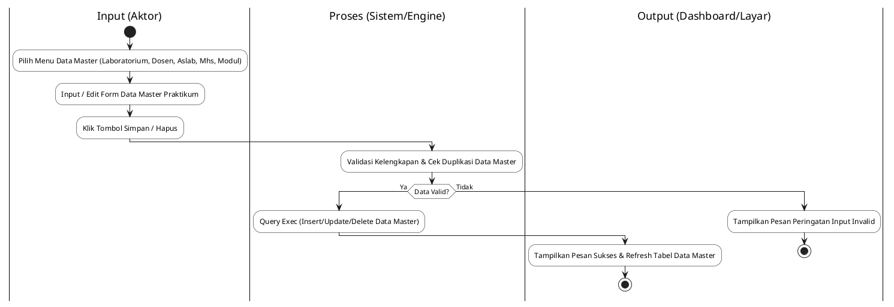
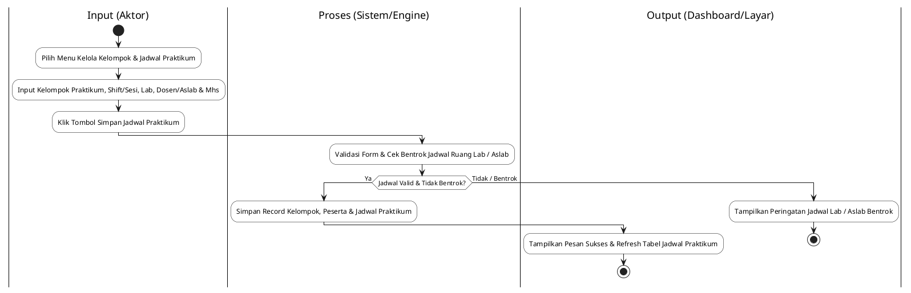
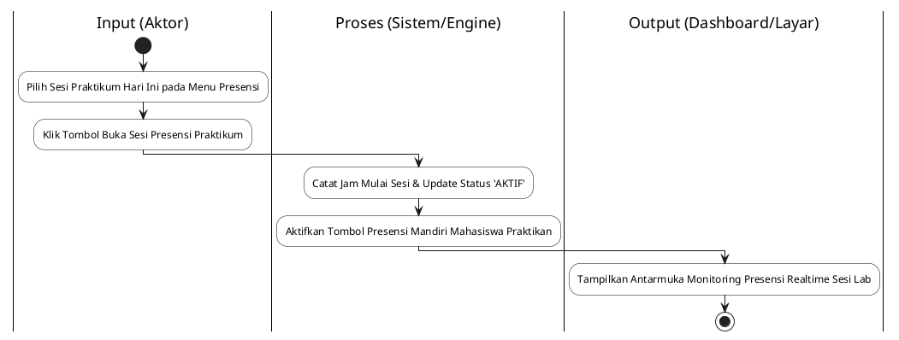
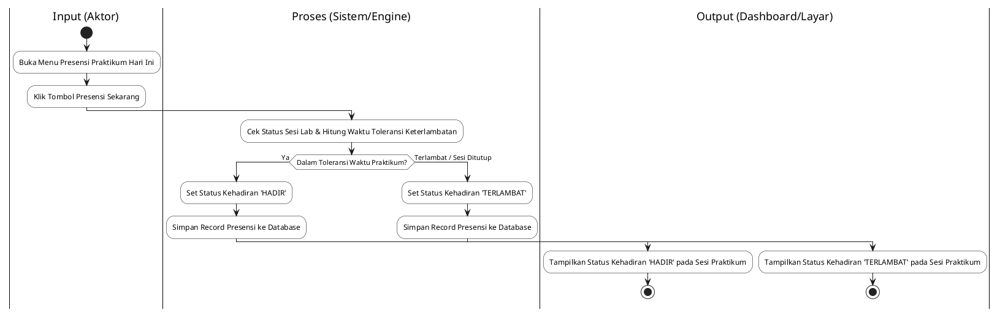
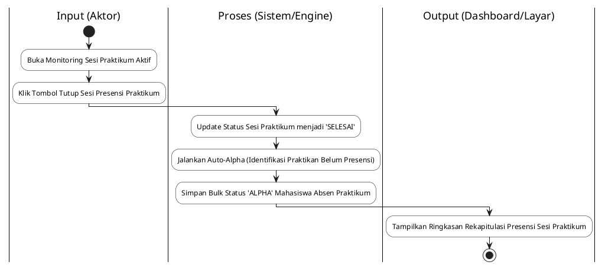
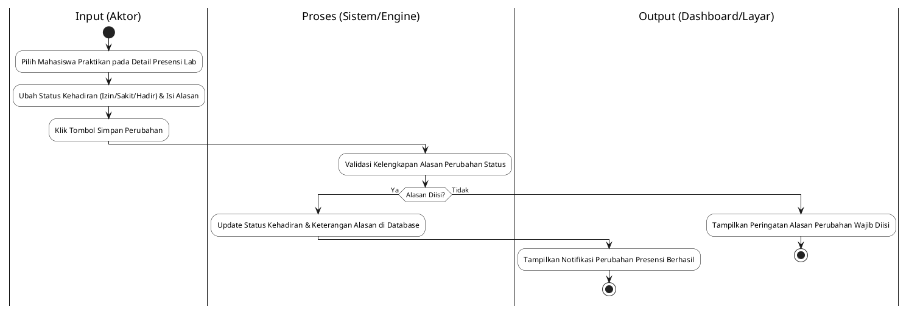
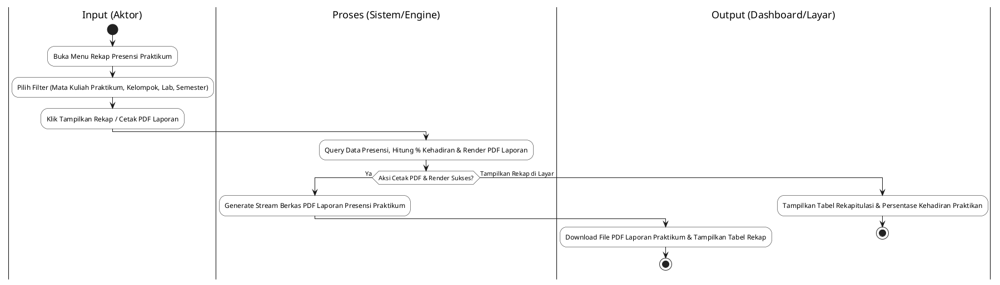

# Dokumen Spesifikasi Activity Diagram
## Sistem Informasi Presensi Praktikum Mahasiswa di Fakultas Teknologi Informasi Universitas Bale Bandung

Dokumen ini berisi spesifikasi **8 Activity Diagram Utama** (Format 3 Swimlane Bingkai Penuh: `Input (Aktor)`, `Proses (Sistem/Engine)`, `Output (Dashboard/Layar)`) yang telah disesuaikan dengan konteks **Presensi Praktikum Mahasiswa FTI UNIBBA**.

Daftar 8 Activity Diagram:
1. **Activity Diagram 1: Login**
2. **Activity Diagram 2: Kelola Data Master Praktikum**
3. **Activity Diagram 3: Konfigurasi Kelompok & Jadwal Praktikum**
4. **Activity Diagram 4: Buka Sesi Presensi Praktikum**
5. **Activity Diagram 5: Presensi Mandiri Praktikan**
6. **Activity Diagram 6: Tutup Sesi Presensi Praktikum & Auto-Alpha**
7. **Activity Diagram 7: Ubah Status Kehadiran Praktikum**
8. **Activity Diagram 8: Rekap Presensi & Cetak Laporan Praktikum PDF**

---

## 1. Activity Diagram 1: Login

---

## 2. Activity Diagram 2: Kelola Data Master Praktikum

---

## 3. Activity Diagram 3: Konfigurasi Kelompok & Jadwal Praktikum

---

## 4. Activity Diagram 4: Buka Sesi Presensi Praktikum

---

## 5. Activity Diagram 5: Presensi Mandiri Praktikan

---

## 6. Activity Diagram 6: Tutup Sesi Presensi Praktikum & Auto-Alpha

---

## 7. Activity Diagram 7: Ubah Status Kehadiran Praktikum

---

## 8. Activity Diagram 8: Rekap Presensi & Cetak Laporan Praktikum PDF

