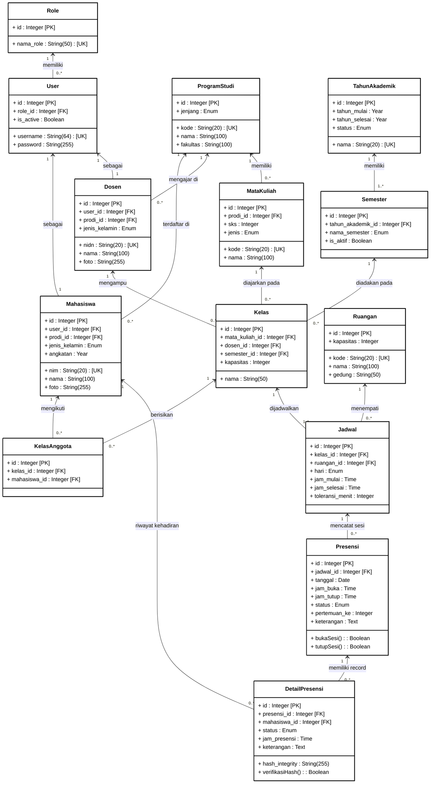

# D. CLASS DIAGRAM

Class Diagram merupakan salah satu diagram utama dalam UML (*Unified Modeling Language*) yang menggambarkan struktur statis dari sistem perkuliahan dan presensi. Diagram ini menyajikan kelas-kelas (*classes*), atribut (*attributes*), metode/operasi (*methods/functions*), serta hubungan kardinalitas antar-kelas (*relationships*) yang membangun arsitektur basis data dan objek sistem.

---

### **D.0. Legenda Notasi Class Diagram**

Berikut adalah notasi standar UML Class Diagram yang digunakan pada sistem ini:

| Notasi / Komponen | Arti & Deskripsi |
| :---: | :--- |
| **Class Box** | Modul / tabel objek yang berisi nama kelas, atribut, dan metode. |
| **`+` (Public)** | Atribut atau metode yang dapat diakses secara terbuka dari luar kelas. |
| **`[PK]` (Primary Key)** | Atribut pembeda unik utama (*Primary Key*) pada kelas. |
| **`[FK]` (Foreign Key)** | Atribut kunci asing (*Foreign Key*) yang menghubungkan kelas dengan kelas lain. |
| **`[UK]` (Unique Key)** | Atribut unik yang tidak boleh bernilai sama antar-record. |
| **`1` to `0..*` / `1..*`** | Kardinalitas relasi (*Multiplicity*) antar-kelas (misal: 1 data memiliki 0 hingga banyak data terkait). |

---

### **D.1. Diagram Visual (Mermaid.js)**

---

### **D.2. Penjelasan Detail Struktur Kelas (Entities & Attributes)**

Sistem Informasi Presensi Perkuliahan terdiri dari **14 Kelas Utama** yang dikelompokkan ke dalam 4 modul utama:

#### **1. Kelompok Manajemen Akses & Pengguna (User Management)**
- **Kelas `Role`**: Menyimpan data hak akses pengguna sistem (seperti `Admin`, `Dosen`, `Mahasiswa`).
  - `id` [PK]: Identitas unik role.
  - `nama_role` [UK]: Nama level hak akses.
- **Kelas `User`**: Menyimpan akun pengguna untuk autentikasi sistem.
  - `id` [PK], `role_id` [FK], `username` [UK], `password` (terenkripsi SHA-256), `is_active` (status akun aktif/non-aktif).
- **Kelas `Dosen`**: Menyimpan profil akademis tenaga pengajar.
  - `id` [PK], `user_id` [FK], `prodi_id` [FK], `nidn` [UK], `nama`, `jenis_kelamin`, `foto`.
- **Kelas `Mahasiswa`**: Menyimpan profil data mahasiswa terdaftar.
  - `id` [PK], `user_id` [FK], `prodi_id` [FK], `nim` [UK], `nama`, `jenis_kelamin`, `angkatan`, `foto`.

#### **2. Kelompok Struktur Akademik (Academic Master Data)**
- **Kelas `ProgramStudi`**: Menyimpan data jurusan/program studi di fakultas.
  - `id` [PK], `kode` [UK], `nama`, `jenjang` (D3/S1/S2), `fakultas`.
- **Kelas `TahunAkademik`**: Menyimpan periode tahun ajaran perkuliahan.
  - `id` [PK], `nama` [UK], `tahun_mulai`, `tahun_selesai`, `status` (AKTIF/NON-AKTIF).
- **Kelas `Semester`**: Menyimpan pembagian semester akademis.
  - `id` [PK], `tahun_akademik_id` [FK], `nama_semester` (GANJIL/GENAP), `is_aktif`.
- **Kelas `MataKuliah`**: Menyimpan kurikulum daftar mata kuliah.
  - `id` [PK], `prodi_id` [FK], `kode` [UK], `nama`, `sks`, `jenis` (Wajib/Pilihan).
- **Kelas `Ruangan`**: Menyimpan lokasi fisik ruang perkuliahan.
  - `id` [PK], `kode` [UK], `nama`, `kapasitas`, `gedung`.

#### **3. Kelompok Perkuliahan & Penjadwalan (Class & Schedule)**
- **Kelas `Kelas`**: Menyimpan kelompok pembagian kelas perkuliahan.
  - `id` [PK], `mata_kuliah_id` [FK], `dosen_id` [FK], `semester_id` [FK], `nama`, `kapasitas`.
- **Kelas `KelasAnggota`**: Menyimpan entitas asosiasi mahasiswa peserta kelas tertentu.
  - `id` [PK], `kelas_id` [FK], `mahasiswa_id` [FK].
- **Kelas `Jadwal`**: Menyimpan waktu & lokasi perkuliahan rutin mingguan.
  - `id` [PK], `kelas_id` [FK], `ruangan_id` [FK], `hari`, `jam_mulai`, `jam_selesai`, `toleransi_menit`.

#### **4. Kelompok Presensi & Keamanan Data (Attendance & Security)**
- **Kelas `Presensi`**: Menyimpan sesi buka/tutup presensi kelas per pertemuan.
  - `id` [PK], `jadwal_id` [FK], `tanggal`, `jam_buka`, `jam_tutup`, `status` (AKTIF/SELESAI), `pertemuan_ke`, `keterangan`.
  - **Metode**: `bukaSesi()` (mengaktifkan sesi kehadiran), `tutupSesi()` (menutup sesi & memicu Auto-Alpha).
- **Kelas `DetailPresensi`**: Menyimpan setiap data kehadiran individu mahasiswa per sesi.
  - `id` [PK], `presensi_id` [FK], `mahasiswa_id` [FK], `status` (HADIR/TERLAMBAT/IZIN/SAKIT/ALPHA), `jam_presensi`, `keterangan`, `hash_integrity` (Kunci SHA-256).
  - **Metode**: `verifikasiHash()` (menguji keaslian record dari manipulasi DB).

---

### **D.3. Penjelasan Relasi & Kardinalitas Antar-Kelas**

1. **Role ➔ User (1 to 0..*)**: Satu `Role` dapat dimiliki oleh banyak `User`, namun satu `User` hanya memiliki tepat satu `Role`.
2. **User ➔ Dosen / Mahasiswa (1 to 1)**: Satu `User` bertindak sebagai satu entitas `Dosen` atau satu `Mahasiswa`.
3. **ProgramStudi ➔ Mahasiswa / Dosen / MataKuliah (1 to 0..*)**: Satu `ProgramStudi` membawahi banyak `Mahasiswa`, `Dosen`, dan `MataKuliah`.
4. **TahunAkademik ➔ Semester (1 to 1..*)**: Satu `TahunAkademik` memiliki satu atau lebih `Semester` (Ganjil/Genap).
5. **MataKuliah / Dosen / Semester ➔ Kelas (1 to 0..*)**: Sebuah `Kelas` diampu oleh satu `Dosen`, menginduk pada satu `MataKuliah`, dan diadakan pada satu `Semester`.
6. **Kelas ➔ KelasAnggota ➔ Mahasiswa (Many-to-Many via Junction Table)**: Hubungan antara `Kelas` dan `Mahasiswa` bersifat *Many-to-Many* yang dijembatani oleh tabel `KelasAnggota`.
7. **Kelas ➔ Jadwal (1 to 1..*)**: Satu `Kelas` dapat memiliki satu atau lebih jadwal perkuliahan mingguan.
8. **Ruangan ➔ Jadwal (1 to 0..*)**: Satu `Ruangan` dapat digunakan oleh banyak `Jadwal` di jam/hari berbeda.
9. **Jadwal ➔ Presensi (1 to 0..*)**: Satu `Jadwal` mencatat sesi `Presensi` pada setiap pertemuan mingguan.
10. **Presensi ➔ DetailPresensi (1 to 0..*)**: Satu sesi `Presensi` mencakup banyak baris `DetailPresensi` milik anggota kelas.
11. **Mahasiswa ➔ DetailPresensi (1 to 0..*)**: Satu `Mahasiswa` memiliki banyak riwayat record pada `DetailPresensi`.