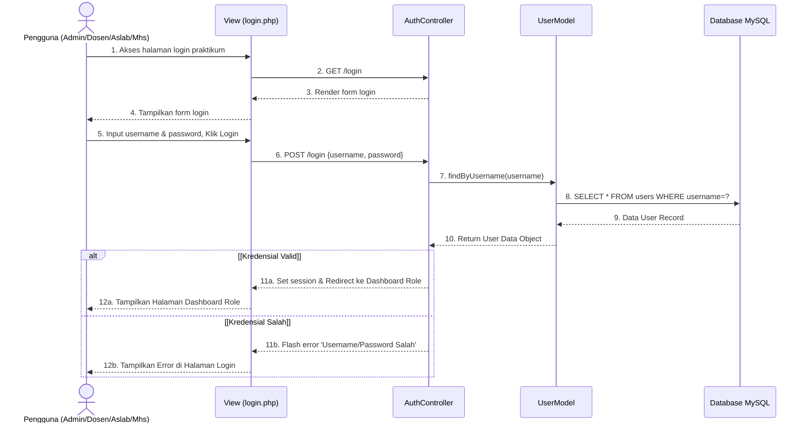
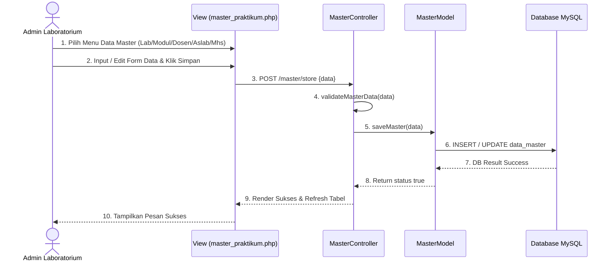
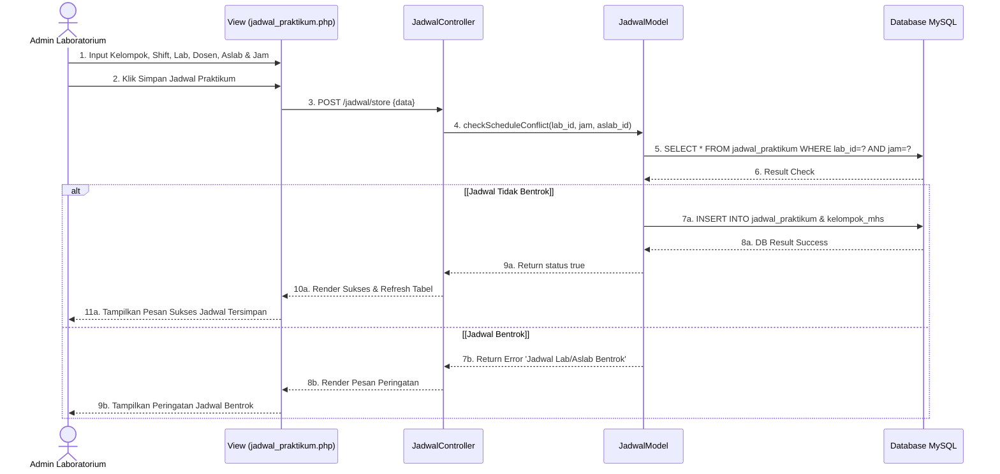
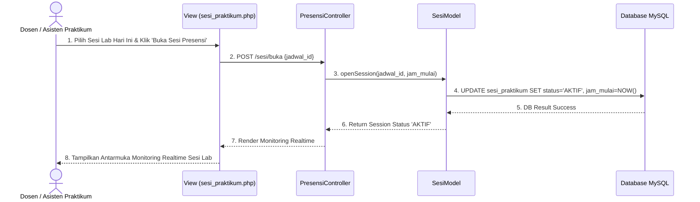
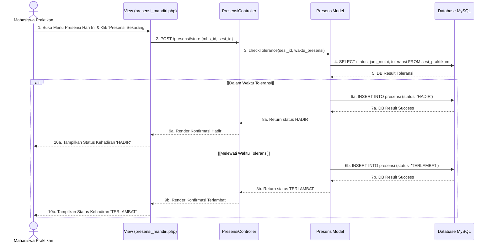
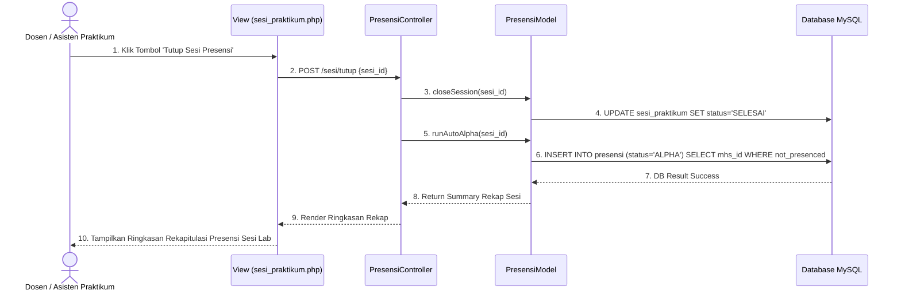
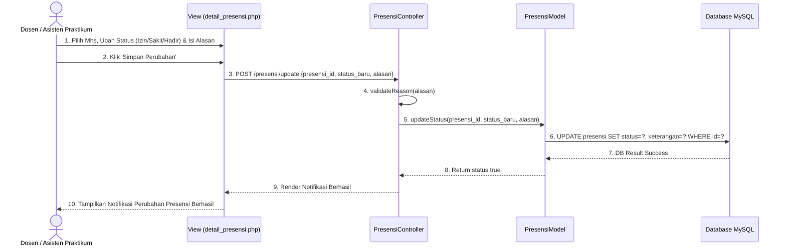
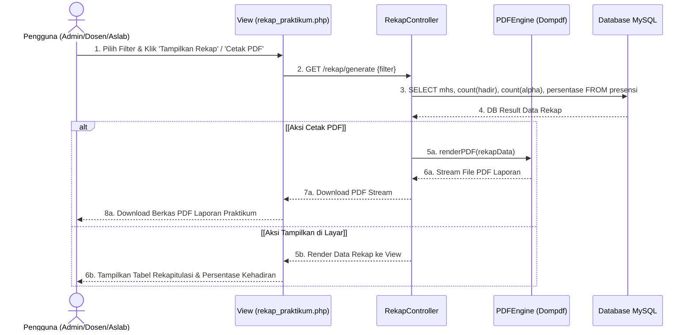

# C. SEQUENCE DIAGRAM
## Sistem Informasi Presensi Praktikum Mahasiswa di Fakultas Teknologi Informasi Universitas Bale Bandung

Dokumen ini berisi spesifikasi **8 Sequence Diagram** yang menggambarkan interaksi alur waktu (*chronological order*) antar komponen perangkat lunak (Aktor, View, Controller, Model, dan Database MySQL) untuk sistem **Presensi Praktikum Mahasiswa FTI UNIBBA** (tanpa fitur khusus SHA-256 / AuditController).

---

### **Legenda Notasi Sequence Diagram**

| Notasi | Nama Notasi | Deskripsi & Fungsi |
| :---: | :--- | :--- |
| **Actor** | Aktor / Pengguna | Pihak luar (Admin Lab, Dosen, Aslab, Mahasiswa) yang berinteraksi dengan sistem. |
| **View (Boundary)** | Antarmuka / Halaman | Komponen halaman antarmuka web (PHP/HTML) tempat pengguna melakukan aksi. |
| **Controller (Control)** | Pengontrol Logika | Komponen pengolah logika bisnis dan pengatur lalu lintas data aplikasi. |
| **Model (Entity)** | Model Data | Komponen pengelola query dan pemetaan entitas ke basis data. |
| **Database (Data Store)** | Basis Data MySQL | Penyimpanan data persisten sistem (MySQL). |
| &rarr; | *Synchronous Message* | Pesan pemanggilan metode/fungsi yang menunggu balasan *response*. |
| - - &dash;&rarr; | *Return Message* | Pesan balasan (*return value*) atau render tampilan ke antarmuka. |
| **alt** | *Alternative Fragment* | Struktur percabangan logika (*if-else*) berdasarkan kondisi tertentu. |

---

### **SD-01: Sequence Diagram — Login Presensi Praktikum**

---

### **SD-02: Sequence Diagram — Kelola Data Master Praktikum**

---

### **SD-03: Sequence Diagram — Konfigurasi Kelompok & Jadwal Praktikum**

---

### **SD-04: Sequence Diagram — Buka Sesi Presensi Praktikum**

---

### **SD-05: Sequence Diagram — Presensi Mandiri Praktikan**

---

### **SD-06: Sequence Diagram — Tutup Sesi Presensi Praktikum & Auto-Alpha**

---

### **SD-07: Sequence Diagram — Ubah Status Kehadiran Praktikum**

---

### **SD-08: Sequence Diagram — Rekap Presensi & Cetak Laporan Praktikum PDF**

